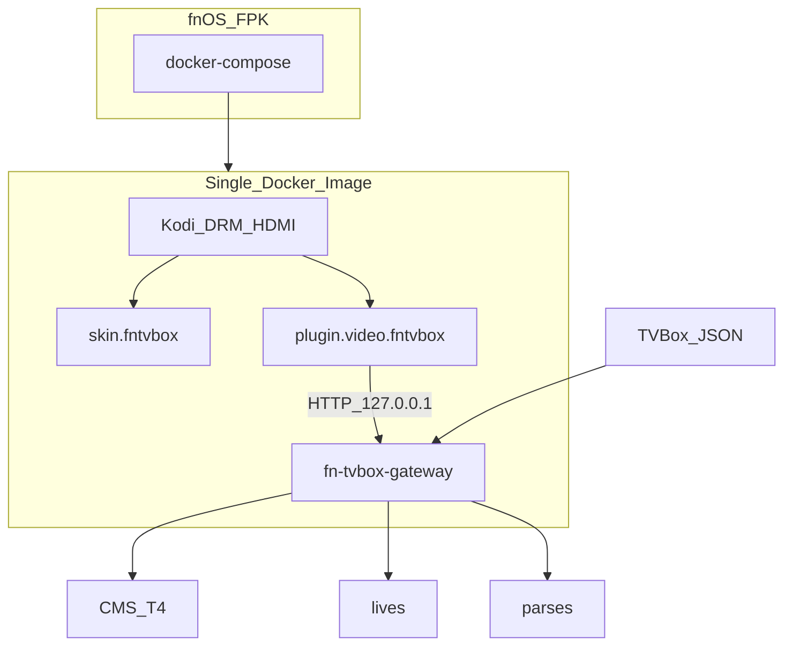

# FnKodi_TVBOX — 实现路线与部署手册

> **给 AI / 构建机的执行说明**  
> 按阶段 **P0 → P10** 顺序执行。每完成一个子任务勾选 `- [ ]` → `- [x]`。  
> **不要跳过验收**。遇到「明确不做」条款一律拒绝实现。  
> API 细节以 [`docs/api-contract.md`](docs/api-contract.md) 为准。  
> 背景与产品目标见 [`项目说明.md`](项目说明.md)。

---

## 0. 已锁定决策与原则

### 0.1 产品目标（摘要）

在飞牛 OS（fnOS）上交付一个 **第三方 FPK 应用**：

- **单个 Docker 镜像**，镜像内只保留需要的组件。
- 保留 Kodi 播放与 HDMI/DRM 直出能力。
- 支持 TVBox 订阅接口：点播直链/解析后播放、直播地址等。
- **不修改 Kodi C++ 源码**；TVBox 能力以「插件 + 网关」形式接入。
- UI 用 **自定义 Kodi Skin + 视频插件**，首页/分类尽量贴近 TVBox。
- **热路径用 Go**；Python 仅作 Kodi 插件薄桥接。
- **极致性能**：少进程、少依赖、可裁剪官方 addon、网关并发与缓存。

### 0.2 已锁定技术决策

| 项 | 决策 |
|----|------|
| 源能力 V1 | TVBox `type 0/1/2`（CMS）+ `type 4`（T4）+ `lives` + `parses` |
| Android / JAR | **禁止**：不打包、不运行、不依赖 |
| DRPY / Node 爬虫 | V1 **不支持**（type3 跳过） |
| UI | `skin.fntvbox` + `plugin.video.fntvbox` |
| 播放器 | **仅 Kodi**（禁止 Chromium/mpv 播放链） |
| 构建 | 本机可不编译；Linux 构建机跑 `scripts/build-all.sh`；产物进 `release/` |
| 参考只读 | `../bao-tv-box-master`（协议）、`../fn-apps-main/fn-kodi`（FPK/HDMI） |

### 0.3 明确不做（防跑偏）

1. 不引入 Android Spider / JAR / ReDroid / 任何安卓容器或 APK。  
2. V1 不内嵌 DRPY/Node/QuickJS 爬虫运行时。  
3. 不改 Kodi 源码、不打 Kodi 私有补丁。  
4. 不做独立 TV Web 前端替代 Skin（播放与主导航在 Kodi 内）。  
5. 不把 `bao-tv-box` 的 Node 服务原样塞进镜像。  
6. 本机 Windows 不强制跑 Docker 构建；重构建在 Linux 服务器完成。

### 0.4 目标架构

```text
fnOS FPK
  └── docker-compose
        └── 单容器镜像 fnkodi-tvbox
              ├── fn-tvbox-gateway (Go)  :18765  本机
              ├── Kodi (DRM/HDMI)
              │     ├── skin.fntvbox
              │     └── plugin.video.fntvbox ──HTTP──► gateway
              └── 数据卷 /root/.kodi + /var/lib/fn-tvbox
```



---

## 1. 环境与前置

### 1.1 开发机（可为 Windows，性能弱）

用途：改代码、写插件、本地静态检查。

建议工具：

- Git
- 编辑器 / Cursor
- （可选）Go 1.22+ 仅用于语法检查
- （可选）Python 3.11+ 语法检查

**不要求**在开发机成功 `docker build`。

### 1.2 Linux 构建机（必须）

```bash
# 验收：以下命令均可用
uname -s   # Linux
go version # go1.22+
docker version
# fnpack / fygopack：参考 fn-apps-main/build.py 的获取方式，或预装到 PATH
which fnpack || which fygopack || echo "NEED_FNPACK"
```

权限：可访问 Docker daemon；能拉取基础镜像（或离线导入）。

### 1.3 目标设备

- 硬件：零刻 mini N200 等 x86_64，12G 内存级
- 系统：飞牛 NAS / fnOS
- 连接：主机 HDMI → 电视
- 设备节点：`/dev/dri`、`/dev/snd`、`/dev/input` 存在

### 1.4 旁路参考路径（只读，勿复制进 git 作为子模块强制依赖）

| 路径 | 用途 |
|------|------|
| `C:\D\Code\FnKodi_TVBOX\bao-tv-box-master` | TVBox 订阅/CMS/T4/直播/解析语义 |
| `C:\D\Code\FnKodi_TVBOX\fn-apps-main\fn-kodi` | FPK 目录、compose 设备直通 |
| `https://developer.fnnas.com/docs/guide` | 飞牛 APP 开发文档 |
| 镜像 `wjz304/kodi:latest` | Kodi 21 + DRM 基线（后续裁剪） |

Linux 构建机若无上述 Windows 路径，可将参考仓 clone 到任意只读位置，并在任务中替换路径。

---

## 2. 仓库目录规范（强制）

完成后的仓库必须呈现：

```text
FnKodi_TVBOX/
├── 项目说明.md
├── 实现路线与部署.md          # 本文件
├── LICENSE
├── .gitignore
├── VERSION                    # 纯文本版本号，如 0.1.0
├── docs/
│   └── api-contract.md
├── plugins/
│   ├── fn-tvbox-gateway/      # Go 网关（需编译）
│   ├── plugin.video.fntvbox/  # Kodi 视频插件（不编译）
│   └── skin.fntvbox/          # 自定义 Skin（不编译）
├── docker/
│   ├── Dockerfile
│   └── entrypoint.sh
├── fpk/                       # fnOS 包装（应用名见 P7）
│   ├── manifest
│   ├── ICON.PNG
│   ├── ICON_256.PNG
│   ├── app/
│   │   ├── docker/docker-compose.yaml
│   │   └── ui/...
│   ├── cmd/
│   ├── config/
│   ├── i18n/
│   └── wizard/
├── scripts/
│   ├── build-gateway.sh
│   ├── package-addons.sh
│   ├── build-image.sh
│   ├── build-fpk.sh
│   ├── build-all.sh
│   └── common.sh
└── release/                   # 构建产物（内容 gitignore）
    ├── .gitkeep
    ├── gateway/
    ├── addons/
    ├── images/
    └── fpk/
```

**规则：**

1. 每个插件/组件代码 **只** 放在自己的 `plugins/<name>/`。  
2. 需要编译的组件提供独立构建脚本入口；禁止在别的插件目录里编别人。  
3. 所有对外交付物必须复制/导出到 `release/` 对应子目录。  
4. `release/**` 二进制与镜像 tar **不提交 git**（保留目录与 `.gitkeep`）。

---

## 3. 分阶段实现（AI 可执行）

---

### P0 — 仓库脚手架

#### 目标

建立目录、忽略规则、占位 README、`VERSION`，保证后续阶段有落点。

#### 任务

##### P0.1 创建目录树

- [ ] 按第 2 节创建全部空目录（含 `release/*/.gitkeep`）。

##### P0.2 写入 `.gitignore`

- [ ] 至少包含：

```gitignore
release/**
!release/**/.gitkeep
*.fpk
*.tar
*.tar.gz
.DS_Store
Thumbs.db
plugins/fn-tvbox-gateway/bin/
plugins/fn-tvbox-gateway/dist/
__pycache__/
*.pyc
.idea/
.vscode/
*.log
```

##### P0.3 `VERSION`

- [ ] 文件内容一行：`0.1.0`

##### P0.4 各插件 README 占位

- [ ] `plugins/fn-tvbox-gateway/README.md`：说明这是 Go 网关、如何本地 `go test`、产物路径 `release/gateway/`。
- [ ] `plugins/plugin.video.fntvbox/README.md`：说明 Kodi addon、依赖网关、不爬站。
- [ ] `plugins/skin.fntvbox/README.md`：说明 Skin 目标（TVBox 风格首页/分类）。

##### P0.5 验收

```bash
test -f VERSION && test -f .gitignore
test -d plugins/fn-tvbox-gateway
test -d plugins/plugin.video.fntvbox
test -d plugins/skin.fntvbox
test -d release/gateway && test -d release/addons
```

全部成功即 P0 完成。

---

### P1 — Go 网关骨架

#### 目标

可运行的 HTTP 服务：`GET /health`、配置加载、结构化日志。

#### 目录建议

```text
plugins/fn-tvbox-gateway/
├── go.mod
├── go.sum
├── cmd/gateway/main.go
├── internal/
│   ├── config/config.go
│   ├── httpapi/router.go
│   ├── httpapi/health.go
│   └── logging/logging.go
├── Makefile
└── README.md
```

#### 任务

##### P1.1 初始化模块

- [ ] `cd plugins/fn-tvbox-gateway && go mod init github.com/zhanqinwen/FnKodi_TVBOX/fn-tvbox-gateway`（module path 可按仓库调整，但全文保持一致）。
- [ ] Go 版本在 `go.mod` 中声明 `1.22` 或更高。

##### P1.2 配置

- [ ] 从环境变量读取，见 `docs/api-contract.md` §0.1。
- [ ] 无效监听地址时进程 **非 0 退出**。

##### P1.3 路由

- [ ] `GET /health` 返回契约 JSON。
- [ ] 未实现的 `/api/*` 暂返回 `501` + `{"error":{"code":"not_implemented","message":"..."}}`（后续阶段改为真实实现）。

##### P1.4 本地运行（开发机可选）

```bash
cd plugins/fn-tvbox-gateway
go run ./cmd/gateway
# 另开终端
curl -sS http://127.0.0.1:18765/health
```

##### P1.5 `scripts/build-gateway.sh`（可先写最小版）

```bash
#!/usr/bin/env bash
set -euo pipefail
ROOT="$(cd "$(dirname "$0")/.." && pwd)"
source "$ROOT/scripts/common.sh"
VER="$(cat "$ROOT/VERSION")"
OUT="$ROOT/release/gateway"
mkdir -p "$OUT"
cd "$ROOT/plugins/fn-tvbox-gateway"
CGO_ENABLED=0 GOOS=linux GOARCH=amd64 go build -trimpath -ldflags "-s -w -X main.version=${VER}" -o "$OUT/fn-tvbox-gateway" ./cmd/gateway
echo "built $OUT/fn-tvbox-gateway"
```

- [ ] Linux 构建机执行成功，产物为静态链接优先（`CGO_ENABLED=0`）。

##### P1.6 验收

```bash
curl -sS http://127.0.0.1:18765/health | grep '"ok":true'
# 或对已编译二进制：
./release/gateway/fn-tvbox-gateway &
sleep 1
curl -sS http://127.0.0.1:18765/health
kill %1
```

##### P1.7 排查

| 现象 | 处理 |
|------|------|
| 端口占用 | 改 `FNTVBOX_LISTEN` |
| Windows 编出的二进制不能在 Linux 容器跑 | 必须在 Linux 用 `GOOS=linux` 交叉/本地编 |

---

### P2 — TVBox 订阅与 CMS / T4

#### 目标

拉取并解析 TVBox 订阅；过滤不支持站点；实现源/分类/列表/详情/搜索 API。

#### 参考文件（只读对照语义）

- `bao-tv-box-master/src/server/omnibox/tvboxConfig.ts` — 订阅解析、JSON5、体积限制  
- `bao-tv-box-master/src/server/omnibox/tvboxWarehouse.ts` — 多仓  
- `bao-tv-box-master/src/server/omnibox/tvbox2.ts` — sites 分发、CMS/T4  
- `bao-tv-box-master/src/server/omnibox/tvbox2Xml.ts` — 老苹果 XML  

#### 目录建议

```text
internal/
  tvbox/
    config.go          # 拉订阅、JSON/JSON5
    warehouse.go
    types.go           # Site/Config 结构
    filter.go          # 跳过 type3/jar/drpy
  cms/
    client.go          # type 0/1/2
    xml.go
  t4/
    client.go          # type 4
  catalog/
    cache.go           # 内存缓存
  httpapi/
    sources.go
    media.go
    search.go
    subscription.go
```

#### 任务

##### P2.1 订阅拉取

- [ ] 实现 `GET/PUT /api/subscription`、`POST /api/subscription/reload`。
- [ ] 支持标准 JSON；若上游为 JSON5，允许注释与尾逗号（可用成熟库，勿自写残缺解析）。
- [ ] 缓存 TTL = `FNTVBOX_CACHE_TTL_SEC`。
- [ ] 多仓 `warehouse`：先解析入口列表，再按需拉子仓（V1 可先「展开全部 HTTP 子仓」并设并发上限 4）。

##### P2.2 站点过滤

- [ ] `type in {0,1,2,4}` 且 api 为 http(s) → 纳入。
- [ ] `type==3` 或 api 含 `csp_` 或存在 jar → **跳过**，日志：`skip unsupported site key=... reason=android_or_drpy`。
- [ ] 统计写入 subscription 摘要 `skippedUnsupported`。

##### P2.3 `GET /api/sources`

- [ ] 字段对齐契约；`contentKind=vod` 的源供片库使用。

##### P2.4 CMS：categories / media / detail / search

- [ ] type0：XML，`ac=list|videolist|detail` 语义对齐参考实现。
- [ ] type1/2：JSON CMS。
- [ ] 分页从 1 开始；`filters` 按契约传递。

##### P2.5 T4

- [ ] `filter=true`、分类/列表/详情/搜索/play 的 HTTP 形态对齐 `tvbox2.ts` 中 T4 分支。
- [ ] 筛选 `ext` 使用 Base64URL（与参考一致）。

##### P2.6 聚合搜索

- [ ] `GET /api/search`：仅 HTTP 源；默认并发 10；单源超时使用 `FNTVBOX_HTTP_TIMEOUT_MS`。
- [ ] 失败源计入 `failedSourceCount`，不拖垮整体。

##### P2.7 单测

- [ ] 用 `net/http/httptest` 模拟 CMS JSON/XML 与 T4 响应。
- [ ] 覆盖：过滤 type3、分页、详情 episodes 拆分（`$$$` / `#` 等 TVBox 常见分隔，按参考实现）。

```bash
cd plugins/fn-tvbox-gateway && go test ./...
```

##### P2.8 手工验收

准备一个 **仅含 type0/1/2/4** 的测试订阅（可自建最小 JSON）：

```json
{
  "sites": [
    {
      "key": "testcms",
      "name": "TestCMS",
      "type": 1,
      "api": "https://example.com/api.php/provide/vod/",
      "searchable": 1,
      "quickSearch": 1,
      "filterable": 1
    }
  ],
  "lives": [],
  "parses": []
}
```

```bash
export FNTVBOX_SUBSCRIPTION_URL='http://127.0.0.1:9/your-test.json'
# 启动网关后：
curl -sS http://127.0.0.1:18765/api/sources
curl -sS 'http://127.0.0.1:18765/api/sources/testcms/categories'
curl -sS 'http://127.0.0.1:18765/api/sources/testcms/media?categoryId=1&page=1'
```

**通过标准：** JSON 字段名与 `docs/api-contract.md` 一致；type3 站点不出现在 sources。

##### P2.9 排查

| 现象 | 处理 |
|------|------|
| 订阅是微信文章 | 参考 `tvboxConfig` 的公告/重定向处理；V1 可返回明确错误 `upstream_error` |
| 中文乱码 | 统一 UTF-8；XML 按声明编码转换 |
| 源站 TLS 奇怪 | 记录错误；不要全局 `InsecureSkipVerify` 默认开启（仅可配置调试开关且默认 false） |

---

### P3 — 播放解析、直播、代理

#### 目标

`POST /api/player/resolve`、lives、parses、可选 headers 播放代理。

#### 参考

- `tvbox2.ts` resolve / parses  
- `tvbox2Live.ts` m3u/文本直播  
- bao 的 `ResolvedPlay` 字段  

#### 任务

##### P3.1 直链判定

- [ ] 扩展名或内容特征匹配 m3u8/mp4/flv/mkv 等 → 可直接作为 `ResolvedPlay.url`。
- [ ] 附带 site/live headers。

##### P3.2 parses

- [ ] 订阅 `parses[]`：`type=0` 嗅探类 V1 可标记有限支持（无浏览器嗅探则跳过并 `resolve_failed` 说明原因）。
- [ ] `type=1` JSON 解析：请求解析器 URL，取返回 JSON 中的播放地址（字段名兼容参考实现常见键：`url`）。
- [ ] 并发/轮询策略 V1：顺序尝试全局 parses，直到成功或耗尽。

##### P3.3 T4 / CMS play

- [ ] CMS：剧集值可能已是直链或待解析页；按 `parse` 标志决定是否走 parses。
- [ ] T4：调用源站 play 接口再解析。

##### P3.4 直播

- [ ] 解析 `lives`：url 指向 m3u/文本，或内联 groups。
- [ ] `GET /api/live/groups`、`/api/live/channels`。
- [ ] 播放走 resolve，`sourceId=__live__`。

##### P3.5 代理会话

- [ ] 实现 `POST /api/proxy/session` + `GET /api/proxy/play/{token}`。
- [ ] token 随机、TTL 短（如 5–15 分钟）、仅监听本机。

##### P3.6 验收

```bash
# 点播
curl -sS -X POST http://127.0.0.1:18765/api/player/resolve \
  -H 'Content-Type: application/json' \
  -d '{"sourceId":"testcms","mediaId":"1","episodeId":"线路1|0","playUrl":"https://...","playFrom":"线路1"}'

# 直播列表
curl -sS http://127.0.0.1:18765/api/live/groups
curl -sS 'http://127.0.0.1:18765/api/live/channels?group='
```

**通过标准：** 返回含可播放 `url`；需要 headers 时可拿到 proxy `playUrl` 且 curl 能拉到媒体头（HTTP 200）。

##### P3.7 排查

| 现象 | 处理 |
|------|------|
| 403 防盗链 | 必须带 headers 或走 proxy |
| 解析器返回网页 | 记 `resolve_failed`，不要把 HTML 当播放地址 |
| 直播分组密码 | V1 可跳过加密分组并打日志 |

---

### P4 — Kodi 视频插件（Python 薄桥）

#### 目标

标准 Kodi 插件：浏览 → 详情 → `setResolvedUrl`；全部数据来自网关。

#### 目录（Kodi 规范）

```text
plugins/plugin.video.fntvbox/
├── addon.xml
├── fanart.jpg          # 可后续替换
├── icon.png
├── resources/
│   ├── settings.xml    # 网关地址、订阅 URL（可选写穿到网关）
│   ├── language/resource.language.zh_cn/strings.po
│   └── lib/
│       ├── __init__.py
│       ├── router.py
│       ├── api_client.py
│       ├── list_ui.py
│       └── play.py
├── main.py
└── README.md
```

#### 任务

##### P4.1 `addon.xml`

- [ ] `id=plugin.video.fntvbox`
- [ ] `xbmc.python.pluginsource`，提供 `video`
- [ ] 依赖：`xbmc.python` 适用 Kodi 21（Nexus）版本号按官方 wiki

##### P4.2 `api_client.py`

- [ ] 封装契约所有 GET/POST；超时短；错误弹 `xbmcgui.Dialog().notification`
- [ ] 基址默认 `http://127.0.0.1:18765`，可 settings 覆盖

##### P4.3 路由

- [ ] 无参：源列表（或 Skin 入口约定的首页）
- [ ] `action=categories&sourceId=`
- [ ] `action=media&sourceId=&categoryId=&page=`
- [ ] `action=detail&sourceId=&mediaId=`
- [ ] `action=search`（键盘输入 keyword）
- [ ] `action=live_groups` / `live_channels`
- [ ] `action=play&...` → 调 resolve → `setResolvedUrl`

##### P4.4 播放（强制）

```python
# 伪代码 — 必须使用 setResolvedUrl
li = xbmcgui.ListItem(offscreen=True)
li.setPath(resolved_url)
li.setProperty("inputstream", ...)  # 仅当需要且镜像已装 inputstream.adaptive 时
# 若有 headers：优先使用网关 proxy URL，或 ListItem.setProperty 传递（按 Kodi 版本可行方式）
xbmcplugin.setResolvedUrl(handle, True, li)
```

- [ ] 列表项 `IsPlayable=true`，`isFolder=False` 仅用于可播项。
- [ ] **禁止**把爬站逻辑写入 Python。

##### P4.5 设置

- [ ] 订阅 URL：保存后 `PUT /api/subscription`。
- [ ] 网关地址。

##### P4.6 打包脚本 `scripts/package-addons.sh`

- [ ] 将 `plugin.video.fntvbox` 与（P5 的）`skin.fntvbox` 复制/zip 到 `release/addons/`。
- [ ] 保持 Kodi 可直接解压到 `addons/` 的目录结构（zip 内顶层为 `plugin.video.fntvbox/`）。

##### P4.7 验收（容器内或桌面 Kodi）

1. 网关已运行且订阅可用。  
2. 插件能列出源与分类。  
3. 点一集能起播（可用已知直链源）。  
4. 日志无 Python traceback。

##### P4.8 排查

| 现象 | 处理 |
|------|------|
| 点了没播 | 检查 IsPlayable + setResolvedUrl；勿用 Player.play 主路径 |
| 连不上网关 | 确认同容器 `127.0.0.1:18765`；entrypoint 已启 gateway |
| 中文路径 | addon 内全 UTF-8 |

---

### P5 — 自定义 Skin `skin.fntvbox`

#### 目标

视觉与导航接近 TVBox：首页（源/推荐入口）、分类横滑/宫格、详情、播放 OSD 简洁；遥控器焦点清晰。

#### 策略（锁定，勿改成 Web UI）

1. 以 Kodi Estuary 为结构参考 **新建独立 skin id**（不要直接改系统 Estuary 包名冒充）。  
2. 首页主入口聚焦 `plugin.video.fntvbox`（widget / 快捷入口）。  
3. 配色与布局：深色背景、大封面海报墙、少桌面图标噪音；**避免**花哨粒子特效。  
4. 字体优先 Noto CJK（镜像已有中文字体则引用系统字体路径）。

#### 目录

```text
plugins/skin.fntvbox/
├── addon.xml
├── colors/defaults.xml
├── fonts/Font.xml
├── language/resource.language.zh_cn/strings.po
├── media/                 # 必要贴图，控制体积
├── 1080i/
│   ├── Home.xml
│   ├── MyVideoNav.xml     # 或 Dialog 等按实际
│   ├── Includes.xml
│   ├── Includes_Home.xml
│   ├── VideoOSD.xml
│   └── ...
└── README.md
```

#### 任务

##### P5.1 最小可切换 Skin

- [ ] 安装后可在 Kodi 外观中选中 `skin.fntvbox` 并成功加载（允许先从 Estuary 精简拷贝再改）。
- [ ] `addon.xml` 声明正确 `xbmc.gui` 皮肤扩展点。

##### P5.2 首页

- [ ] 首屏可见：应用/品牌名、进入「影视库」（插件）、进入「直播」、进入「搜索/设置」的焦点块。  
- [ ] 不要堆设置项到首屏。

##### P5.3 与插件联动

- [ ] Home 快捷方式 `ActivateWindow(Videos,plugin://plugin.video.fntvbox/,return)` 或等价。  
- [ ] 分类/海报浏览依赖插件目录视图；Skin 负责容器、焦点、海报尺寸。

##### P5.4 遥控器

- [ ] 上下左右焦点环测试；返回键不退出到黑屏死循环。  
- [ ] 播放中 OK/返回行为符合电视习惯。

##### P5.5 体积

- [ ] `media/` 总大小建议 < 15MB；大图压缩。

##### P5.6 验收

- [ ] 切换 Skin 后重启 Kodi，首页可用。  
- [ ] 遥控器可完成：首页 → 源 → 分类 → 详情 → 播放。  
- [ ] 截图对比 TVBox：结构相似即可（不要求像素级）。

##### P5.7 排查

| 现象 | 处理 |
|------|------|
| Skin 加载失败 | 查 `kodi.log` XML 错误行号 |
| 字体方框 | 中文字体未进 Font.xml |
| 焦点看不见 | 补 focus/unfocus 材质 |

---

### P6 — 单镜像 Dockerfile

#### 目标

一个镜像内：精简 Kodi + gateway 二进制 + 预装 addon/skin；entrypoint 拉起双进程。

#### 文件

```text
docker/
  Dockerfile
  entrypoint.sh
```

#### 任务

##### P6.1 基座选择（锁定）

- [ ] **FROM** `wjz304/kodi:latest`（或固定 digest 标签，推荐在 README 写明 digest）。  
- [ ] 后续裁剪：在镜像内 `apt-get remove/purge` 明显无关的 `kodi-game-*`、部分 PVR（若不影响点播）——放入 P10，P6 先保证能跑。

##### P6.2 拷入产物

Dockerfile 构建上下文为 **仓库根**；构建前需已有：

- `release/gateway/fn-tvbox-gateway`
- `release/addons/plugin.video.fntvbox/`（目录或 zip 解压结果）
- `release/addons/skin.fntvbox/`

```dockerfile
# 示意关键步骤（实现时写完整）
COPY release/gateway/fn-tvbox-gateway /usr/local/bin/fn-tvbox-gateway
RUN chmod +x /usr/local/bin/fn-tvbox-gateway
COPY release/addons/plugin.video.fntvbox /opt/fnkodi/addons/plugin.video.fntvbox
COPY release/addons/skin.fntvbox /opt/fnkodi/addons/skin.fntvbox
COPY docker/entrypoint.sh /usr/local/bin/fnkodi-entrypoint.sh
```

- [ ] 首次启动将 addon/skin **rsync/cp** 到 `/root/.kodi/addons/`（若尚不存在），并写 `addon.xml` 启用、设置默认 skin（可通过 guisettings 或高级设置模板）。

##### P6.3 `entrypoint.sh`（双进程）

锁定行为：

1. 创建数据目录 `FNTVBOX_DATA_DIR`。  
2. 后台启动 `fn-tvbox-gateway`。  
3. `curl` 等待 `/health` 最多 30s。  
4. `exec` 原镜像入口或 `kodi-standalone`（保持 DRM 行为与上游 entrypoint 兼容：优先调用上游 `/usr/local/bin/entrypoint.sh` 若存在，并通过环境变量注入；若冲突则在文档记录最终采用的方式）。  
5. 收到 SIGTERM 时先停 Kodi 再停 gateway。

- [ ] **镜像内不得出现** `android`、`redroid`、`emulator`、`jar` 运行时安装。

##### P6.4 `scripts/build-image.sh`

```bash
#!/usr/bin/env bash
set -euo pipefail
ROOT="$(cd "$(dirname "$0")/.." && pwd)"
VER="$(cat "$ROOT/VERSION")"
IMAGE="fnkodi-tvbox:${VER}"
docker build -f "$ROOT/docker/Dockerfile" -t "$IMAGE" "$ROOT"
mkdir -p "$ROOT/release/images"
docker save "$IMAGE" | gzip > "$ROOT/release/images/fnkodi-tvbox_${VER}_amd64.tar.gz"
echo "$IMAGE"
```

##### P6.5 本地/构建机冒烟

```bash
docker run --rm --name fnkodi-test \
  -e FNTVBOX_SUBSCRIPTION_URL='...' \
  -p 18765:18765 \
  fnkodi-tvbox:0.1.0 \
  # 注意：无 /dev/dri 时 Kodi 可能起不来；至少验证 gateway：
docker run --rm -d --name gwtest --entrypoint /usr/local/bin/fn-tvbox-gateway fnkodi-tvbox:0.1.0
docker exec gwtest curl -sS http://127.0.0.1:18765/health
docker rm -f gwtest
```

##### P6.6 验收

- [ ] 镜像内 `which fn-tvbox-gateway`。  
- [ ] `find /opt/fnkodi/addons -name addon.xml` 含两个插件。  
- [ ] `docker history` / `docker run` 无安卓相关包。

---

### P7 — FPK 包装（fnOS）

#### 目标

对齐 `fn-kodi` 的 FPK 结构，应用名建议：`fnkodi-tvbox`（与 manifest `appname` 一致）。

#### 参考复制清单（从 fn-kodi 适配，不要照抄 appname）

| 源（fn-kodi） | 目标（本仓 `fpk/`） |
|---------------|---------------------|
| `manifest` | 改 appname/version/display |
| `app/docker/docker-compose.yaml` | image 改为本地构建的 `fnkodi-tvbox:<ver>` 或私有仓库地址 |
| `cmd/*` | 同生命周期脚本思路 |
| `config/resource` `config/privilege` | Docker 项目与数据共享 |
| `wizard/*` | **增加订阅 URL 向导项** |
| `i18n/*` | 中英文 |
| `app/ui/*` | 可 iframe 到 Kodi web 8080 |

#### 任务

##### P7.1 `fpk/manifest`

```text
appname               = fnkodi-tvbox
version               = 0.1.0
platform              = all
source                = thirdparty
service_port          = 8080,9090,9777
checkport             = true
```

- [ ] version 与根 `VERSION` 同步（`build-fpk.sh` 里 sed 替换）。

##### P7.2 `docker-compose.yaml`（关键段落必须有）

```yaml
services:
  kodi:
    image: fnkodi-tvbox:0.1.0   # 构建时替换
    container_name: fnkodi-tvbox
    restart: unless-stopped
    environment:
      - TZ=Asia/Shanghai
      - LANG=zh_CN.UTF-8
      - FNTVBOX_SUBSCRIPTION_URL=${wizard_subscription_url:-}
      - FNTVBOX_LISTEN=127.0.0.1:18765
    devices:
      - /dev/dri:/dev/dri
      - /dev/snd:/dev/snd
      - /dev/input:/dev/input
    volumes:
      - /run/udev:/run/udev:ro
      - /var/apps/fnkodi-tvbox/shares/kodi/config:/root/.kodi
      - /var/apps/fnkodi-tvbox/shares/tvbox/data:/var/lib/fn-tvbox
    cap_add:
      - SYS_ADMIN
      - SYS_RAWIO
    network_mode: ${wizard_airplay_support:-bridge}
    ports:
      - 8080:8080
      - 9090:9090
      - 9777:9777/udp
    shm_size: "1gb"
```

- [ ] **不要**映射 Android 设备；**不要**再加第二个业务容器（单镜像约束）。

##### P7.3 向导

- [ ] 安装向导字段：`wizard_subscription_url`（字符串，TVBox 接口 URL）。  
- [ ] 可选：网络模式 host/bridge（同 fn-kodi AirPlay 说明）。  
- [ ] 卸载是否删除数据。

##### P7.4 `scripts/build-fpk.sh`

- [ ] 同步 VERSION → manifest。  
- [ ] 确保 compose 中 image 标签正确。  
- [ ] 调用 `fnpack build --directory fpk`（或与 fn-apps `build.py` 相同方式）。  
- [ ] 产出移动到 `release/fpk/fnkodi-tvbox_all_v${VER}.fpk`。

##### P7.5 验收

- [ ] `.fpk` 为 gzip tar，可 `tar -tzf` 看到 `manifest`。  
- [ ] manifest `appname=fnkodi-tvbox`。

##### P7.6 镜像分发说明（写入本节结果到构建机笔记）

fnOS 拉自定义镜像的方式二选一（实现时选定一种写死在 compose）：

1. 构建机 `docker save` → 设备 `docker load` → compose 用本地 tag；或  
2. 推到私有 registry，compose 写 registry 地址。

手册部署章按 **docker load** 作为默认（内网友好）。

---

### P8 — Linux 一键构建

#### 目标

`scripts/build-all.sh` 在构建机一条命令产出全部 `release/` 产物。

#### `scripts/common.sh` 最低要求

```bash
# 统一 ROOT、日志、需在 Linux 上运行的检查
require_linux() {
  if [[ "$(uname -s)" != "Linux" ]]; then
    echo "ERROR: build must run on Linux build server" >&2
    exit 1
  fi
}
```

#### `scripts/build-all.sh` 顺序（锁定）

1. `require_linux`  
2. `build-gateway.sh` → `release/gateway/`  
3. `package-addons.sh` → `release/addons/`  
4. `build-image.sh` → `release/images/*.tar.gz`  
5. `build-fpk.sh` → `release/fpk/*.fpk`  
6. 生成 `release/SHA256SUMS`  

```bash
cd release && find gateway addons images fpk -type f -print0 | sort -z | xargs -0 sha256sum > SHA256SUMS
```

#### 任务

- [ ] 所有脚本 `chmod +x`，`set -euo pipefail`。  
- [ ] 脚本可单独运行（方便只重编 gateway）。  
- [ ] 根 README 或本手册声明：**请在 Linux 构建机执行**。

#### 验收

```bash
./scripts/build-all.sh
test -x release/gateway/fn-tvbox-gateway
test -d release/addons/plugin.video.fntvbox
test -d release/addons/skin.fntvbox
test -f release/images/fnkodi-tvbox_*_amd64.tar.gz
test -f release/fpk/fnkodi-tvbox_all_v*.fpk
test -f release/SHA256SUMS
```

#### 本机 Windows 开发者流程（锁定）

1. 只提交源码。  
2. `git push` 到构建机可拉仓库。  
3. SSH 到构建机 `git pull && ./scripts/build-all.sh`。  
4. 从 `release/` 取 FPK 与镜像 tar 部署到 fnOS。

---

### P9 — 设备部署与联调

见第 5 章《部署手册》；阶段完成标准 = 部署手册验收清单全部勾选。

---

### P10 — 性能与裁剪

#### 目标

镜像更小、启动更快、网关更稳。

#### 任务

##### P10.1 镜像裁剪

- [ ] 列出 `dpkg -l 'kodi*'`，移除游戏/无关 PVR/demo（保留：核心 Kodi、inputstream 如需要、中文字体、VA/DRM 相关）。  
- [ ] 记录「保留包列表」到 `docker/packages.manifest` 便于复现。  
- [ ] 对比裁剪前后镜像 size，写入 `release/images/SIZE.txt`。

##### P10.2 网关性能

- [ ] 订阅缓存、分类/列表缓存（参考 bao 24h 内存缓存，可先做 10–30min）。  
- [ ] HTTP 客户端连接复用（`http.Transport` MaxIdleConns）。  
- [ ] 聚合搜索限流与超时。  
- [ ] 避免在请求路径上 `json.Marshal` 反复拷贝大对象（合理复用）。

##### P10.3 启动优化

- [ ] entrypoint 并行：gateway 启动与 addon 同步安装可重叠。  
- [ ] Kodi 默认皮肤直接 `skin.fntvbox`，减少首次向导。  
- [ ] 测量冷启动到首页可操作时间，目标：**< 30s**（N200 + SSD，不含拉订阅）。

##### P10.4 验收

- [ ] 镜像体积较 P6 基线下降（记下数字）。  
- [ ] 搜索 8 个 HTTP 源：P95 延迟可接受（仍取决于源站）。  
- [ ] 播放起播延迟主要花在源站 resolve，网关自身开销 < 50ms（本地直链 resolve 自测）。

---

## 4. 构建与发布规范

### 4.1 版本号

- 唯一来源：根目录 `VERSION`  
- 同步：gateway `ldflags`、Docker tag、`fpk/manifest`、FPK 文件名  

### 4.2 产物命名

| 产物 | 路径 |
|------|------|
| 网关二进制 | `release/gateway/fn-tvbox-gateway` |
| 插件目录 | `release/addons/plugin.video.fntvbox/` |
| Skin 目录 | `release/addons/skin.fntvbox/` |
| 镜像 | `release/images/fnkodi-tvbox_${VER}_amd64.tar.gz` |
| FPK | `release/fpk/fnkodi-tvbox_all_v${VER}.fpk` |
| 校验 | `release/SHA256SUMS` |

### 4.3 构建机推荐命令

```bash
git clone <本仓URL> FnKodi_TVBOX
cd FnKodi_TVBOX
./scripts/build-all.sh
ls -lh release/fpk release/images
```

### 4.4 CI（可选，非 V1 阻塞）

若加 GitHub Actions：runner 需 Linux + Docker；缓存 Go modules；artifact 上传 `release/`。

---

## 5. 部署手册（fnOS 设备）

### 5.1 准备

- [ ] 电视已用 HDMI 连接主机，输入源正确。  
- [ ] fnOS 已开启 Docker / 应用中心第三方安装能力（按飞牛文档）。  
- [ ] 构建机已产出 FPK + 镜像 tar。  

### 5.2 导入镜像

在 **fnOS 主机**（或能访问其 Docker 的管理机）上：

```bash
# 将 release/images/fnkodi-tvbox_0.1.0_amd64.tar.gz 拷到设备后：
gunzip -c fnkodi-tvbox_0.1.0_amd64.tar.gz | docker load
docker images | grep fnkodi-tvbox
```

确认 tag 与 `fpk/app/docker/docker-compose.yaml` 中 `image:` **完全一致**。

### 5.3 安装 FPK

1. 应用中心 → 安装本地 FPK（或飞牛文档指定的第三方包安装方式）。  
2. 安装向导填写：  
   - **TVBox 订阅 URL**（建议先用自建仅 CMS 的测试接口）  
   - 网络模式：一般 `bridge`；需要 DLNA/AirPlay 再按说明改 `host`  
3. 完成安装并启动应用。

### 5.4 首次启动检查

```bash
docker ps | grep fnkodi-tvbox
docker logs fnkodi-tvbox 2>&1 | tail -n 100
# 容器内：
docker exec fnkodi-tvbox curl -sS http://127.0.0.1:18765/health
docker exec fnkodi-tvbox curl -sS http://127.0.0.1:18765/api/subscription
```

### 5.5 HDMI / DRM 检查

若无画面：

```bash
ls -l /dev/dri
# compose 是否映射 /dev/dri /dev/snd /dev/input /run/udev
# 是否具备 SYS_ADMIN / SYS_RAWIO
docker exec fnkodi-tvbox ls -l /dev/dri
```

仍无画面：对照官方 `fn-kodi` 同机是否正常；比较两应用的 devices/caps 差异。

### 5.6 功能验收清单（P9 完成标准）

- [ ] 电视上看到 Kodi，皮肤为 `skin.fntvbox`（或自动启用）。  
- [ ] 首页能进影视插件。  
- [ ] 能看到订阅中的 CMS/T4 源（无 JAR 源）。  
- [ ] 能打开分类与海报列表。  
- [ ] 详情页能看到线路/集数。  
- [ ] 点播可播放至少一条直链或可解析源。  
- [ ] 直播分组/频道可打开并播放（若订阅含 lives）。  
- [ ] 搜索能出结果（源站可用时）。  
- [ ] 遥控器上下左右/返回/确认正常。  
- [ ] 重启应用后订阅与 Kodi 配置仍在（数据卷持久化）。  

### 5.7 端口与远程

| 端口 | 用途 |
|------|------|
| 8080 | Kodi Web |
| 9090 | JSON-RPC |
| 9777/udp | 事件服务器 |
| 18765 | 网关（默认只绑 127.0.0.1，**不必**对宿主机暴露） |

Web 账号若沿用上游镜像默认，注意修改密码（安全）。

### 5.8 升级

1. 构建机升 `VERSION`，`build-all.sh`。  
2. 设备 `docker load` 新镜像。  
3. 应用中心升级 FPK。  
4. 向导数据默认保留；`/root/.kodi` 与 `/var/lib/fn-tvbox` 不删则用户数据还在。

### 5.9 卸载

- 选择保留数据：仅移除容器/应用入口。  
- 选择删除数据：清理 `/var/apps/fnkodi-tvbox/shares/**`（由 `uninstall_callback` 实现，对齐 fn-kodi）。

### 5.10 常见问题

| 问题 | 原因 | 处理 |
|------|------|------|
| 源列表为空 | 订阅全是 type3 | 换含 CMS/T4 的订阅 |
| 能列不能播 | resolve 失败/防盗链 | 看 gateway 日志；检查 proxy |
| 花屏/绿屏 | 驱动/DRM | 查 intel media；勿乱开软件渲染除非必要 |
| 无声音 | `/dev/snd` 未透传 | 补 devices |
| 插件改了不生效 | 卷里旧 addons | 删容器内对应 addon 或升版本号强制覆盖策略 |

---

## 6. AI 执行总检查表

复制到 Issue/对话中跟踪：

```text
[ ] P0 脚手架
[ ] P1 网关骨架 + build-gateway.sh
[ ] P2 订阅/CMS/T4/搜索
[ ] P3 resolve/直播/proxy
[ ] P4 Kodi 视频插件
[ ] P5 Skin
[ ] P6 Docker 单镜像
[ ] P7 FPK
[ ] P8 build-all.sh 全绿
[ ] P9 设备验收清单全勾
[ ] P10 裁剪与性能
```

**完成定义（DoD）：**  
Linux 构建机产出 `release/fpk/*.fpk` + 镜像 tar；fnOS 安装后 HDMI 出画；自定义 Skin 下完成 CMS 点播与直播播放；镜像与文档均无 Android 组件。

---

## 7. 推荐实现顺序（给 AI 的会话策略）

1. **一次会话只做一个 Pn 或 Pn 的 2–3 个子任务**，结束前提交可运行增量。  
2. 每个会话结束运行该阶段「验收」命令，把输出贴回。  
3. 改 API 必须同步改 `docs/api-contract.md`。  
4. 禁止引入计划外依赖（Node 主服务、Android、Chromium kiosk）。  
5. 从 bao-tv-box **只移植语义与算法**，用 Go 重写；不要生成巨型自动翻译垃圾代码。  

---

## 8. 附录 A — 最小 TVBox 单仓测试模板

```json
{
  "spider": "",
  "sites": [
    {
      "key": "demo_cms",
      "name": "DemoCMS",
      "type": 1,
      "api": "https://REPLACE_WITH_REAL_CMS/api.php/provide/vod/",
      "searchable": 1,
      "quickSearch": 1,
      "filterable": 1
    }
  ],
  "lives": [
    {
      "name": "DemoLive",
      "type": 0,
      "url": "https://REPLACE_WITH_M3U/live.m3u",
      "epg": "",
      "logo": ""
    }
  ],
  "parses": [
    {
      "name": "本机直链",
      "type": 0,
      "url": ""
    }
  ]
}
```

将 `REPLACE_*` 换成真实可访问地址后再用于联调。

---

## 9. 附录 B — 关键环境变量速查

| 变量 | 作用域 | 说明 |
|------|--------|------|
| `FNTVBOX_LISTEN` | 容器 | 网关监听 |
| `FNTVBOX_SUBSCRIPTION_URL` | 容器 | 订阅 URL（向导注入） |
| `FNTVBOX_DATA_DIR` | 容器 | 网关数据目录 |
| `TZ` / `LANG` | 容器 | 时区与语言 |
| `wizard_subscription_url` | compose | FPK 向导 |
| `wizard_airplay_support` | compose | `bridge`/`host` |

---

## 10. 附录 C — 与 BaoTvBox / fn-kodi 的边界

| 能力 | BaoTvBox | fn-kodi | 本项目 |
|------|----------|---------|--------|
| HDMI 播放 | Chromium/mpv | Kodi | **Kodi** |
| TVBox 协议 | TypeScript 全量 | 无 | **Go 子集（无 Android/DRPY）** |
| UI | React TV | Kodi 默认皮 | **自定义 Skin + 插件** |
| 打包 | 自有 FPK | 薄 FPK 拉镜像 | **FPK + 自建单镜像** |
| 镜像数 | 多容器 | 1 | **1** |

---

**文档版本：** 与仓库初始路线同步（2026-08-08）  
**维护要求：** 任一阶段落地导致目录/API 变更时，必须更新本文与 `docs/api-contract.md`。
