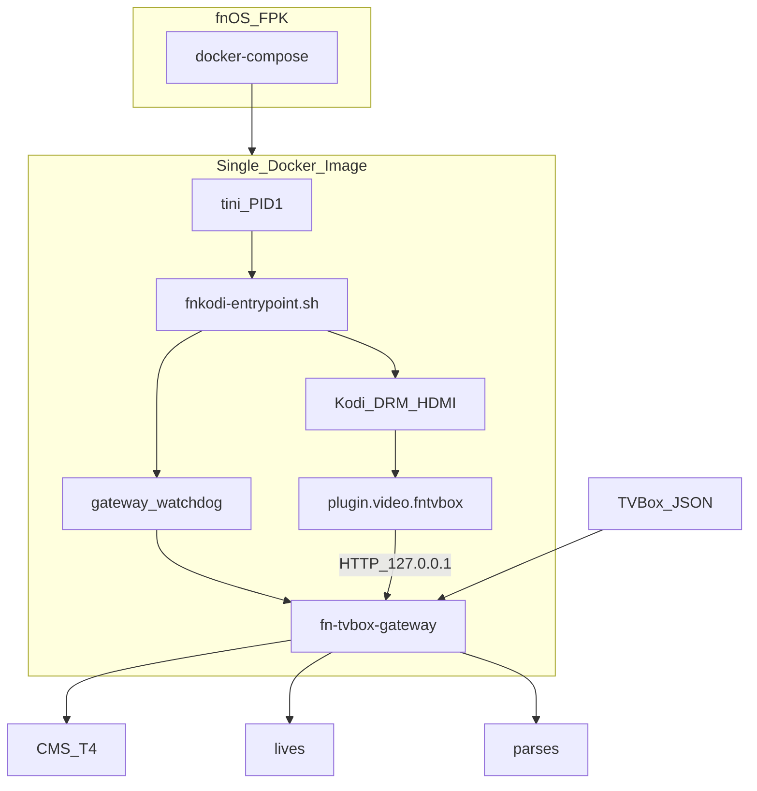

# FnKodi_TVBOX — 实现路线与部署手册

> **给 AI / 构建机的执行说明**  
> 按阶段 **P0 → P10** 顺序执行。每完成一个子任务勾选 `- [ ]` → `- [x]`。  
> **不要跳过验收**。遇到「明确不做」条款一律拒绝实现。  
> API 细节以 [`docs/api-contract.md`](docs/api-contract.md) 为准。  
> 背景与产品目标见 [`项目说明.md`](项目说明.md)。  
> **自定义 Skin 不在 V1 主路径**：见 [`docs/skin-fntvbox-实现步骤.md`](docs/skin-fntvbox-实现步骤.md)，可后期附加。

**文档版本：** 2026-08-08-r2（信号管理 / 看门狗 / 超时拆分 / 插件优先）

---

## 0. 已锁定决策与原则

### 0.1 产品目标（摘要）

在飞牛 OS（fnOS）上交付一个 **第三方 FPK 应用**：

- **单个 Docker 镜像**，镜像内只保留需要的组件。
- 保留 Kodi 播放与 HDMI/DRM 直出能力。
- 支持 TVBox 订阅接口：点播直链/解析后播放、直播地址等。
- **不修改 Kodi C++ 源码**；TVBox 能力以「插件 + 网关」形式接入。
- **V1 UI = 视频插件** `plugin.video.fntvbox`（默认 Estuary 皮肤即可完整使用）；自定义 Skin **后期可选附加**。
- **热路径用 Go**；Python 仅作 Kodi 插件薄桥接。
- **极致性能**：少进程、少依赖、可裁剪官方 addon、网关并发与缓存。

### 0.2 已锁定技术决策

| 项 | 决策 |
|----|------|
| 源能力 V1 | TVBox `type 0/1/2`（CMS）+ `type 4`（T4）+ `lives` + `parses` |
| Android / JAR | **禁止**：不打包、不运行、不依赖 |
| DRPY / Node 爬虫 | V1 **不支持**（type3 跳过） |
| UI（V1） | **仅** `plugin.video.fntvbox`；默认 Kodi 皮肤可用 |
| UI（后期） | `skin.fntvbox` 见独立文档；**不阻塞** V1 交付 |
| 播放器 | **仅 Kodi**（禁止 Chromium/mpv 播放链） |
| 进程模型 | 单容器双进程：`tini` → `entrypoint.sh`（**保留 shell，禁止 exec 掉自己**）→ Kodi + gateway 看门狗 |
| 网关监听 | `127.0.0.1:18765`；compose **禁止**映射 18765 到宿主机 |
| HTTP 超时 | **拆分**：短请求超时 vs 媒体流 TTFB 超时（见契约 §0.1） |
| 契约版本 | `apiVersion=v1`；插件启动校验 |
| 构建 | 本机可不编译；Linux 构建机跑 `scripts/build-all.sh`；产物进 `release/` |
| 参考只读 | `../bao-tv-box-master`（协议）、`../fn-apps-main/fn-kodi`（FPK/HDMI） |

### 0.3 明确不做（防跑偏）

1. 不引入 Android Spider / JAR / ReDroid / 任何安卓容器或 APK。  
2. V1 不内嵌 DRPY/Node/QuickJS 爬虫运行时。  
3. 不改 Kodi 源码、不打 Kodi 私有补丁。  
4. V1 **不做**自定义 Skin 作为交付阻塞项；不做独立 TV Web 前端替代导航。  
5. 不把 `bao-tv-box` 的 Node 服务原样塞进镜像。  
6. 本机 Windows 不强制跑 Docker 构建；重构建在 Linux 服务器完成。  
7. **禁止**在 `entrypoint.sh` 里对多进程场景使用 `exec` 替换 shell（会丢失 trap / 孤儿化 gateway）。  
8. **禁止**用同一个带整体 `Timeout` 的 `http.Client` 做媒体流式转发。

### 0.4 Skin 后期附加（已确定）

| 问题 | 结论 |
|------|------|
| Skin 未完成能否使用？ | **能**。V1 用默认 Estuary + 视频插件即可浏览/搜索/点播/直播。 |
| 能否后期附加？ | **能**。按 [`docs/skin-fntvbox-实现步骤.md`](docs/skin-fntvbox-实现步骤.md) 单独做；镜像/FPK 可再发一版预装 Skin，不影响网关契约。 |
| V1 仓库是否保留 skin 目录？ | 仅占位 README 指向独立文档；**不**纳入 `build-all` / P6 镜像强制产物。 |

### 0.5 目标架构

```text
fnOS FPK
  └── docker-compose
        └── 单容器镜像 fnkodi-tvbox
              ├── tini (PID 1)
              │     └── fnkodi-entrypoint.sh   ← 保留进程，负责 trap/wait
              │           ├── gateway-watchdog → fn-tvbox-gateway :18765
              │           └── 上游 kodi entrypoint / kodi-standalone
              ├── plugin.video.fntvbox ──HTTP──► gateway
              └── 数据卷 /root/.kodi + /var/lib/fn-tvbox
```



### 0.6 双进程信号与看门狗（动手前锁定，禁止返工）

基础镜像为 `tini -- entrypoint.sh`。**tini 只把信号转发给它直接跟踪的那一个子进程**。因此：

#### 错误做法（禁止）

```bash
# 禁止：exec 掉 shell 后 gateway 变孤儿，SIGTERM 到不了 gateway，有序关闭逻辑消失
fn-tvbox-gateway &
wait_for_health
exec /usr/local/bin/entrypoint.sh   # ← 禁止
```

#### 正确做法（锁定）

1. Dockerfile：`ENTRYPOINT ["/usr/bin/tini","--","/usr/local/bin/fnkodi-entrypoint.sh"]`  
2. `fnkodi-entrypoint.sh` **始终保持为 tini 的直接子进程**（不对自己 `exec`）。  
3. 用 `trap` 处理 `SIGTERM`/`SIGINT`：  
   - 先向 **Kodi 进程组**发信号并 `wait` 其退出；  
   - 再停 gateway 看门狗与 gateway；  
   - 然后 `exit`。  
4. 启动上游 Kodi：**子进程方式调用**上游 `/usr/local/bin/entrypoint.sh`（或等价命令），**不要** `exec`。记录 `KODI_PID`，主流程 `wait "$KODI_PID"`。  
5. Gateway 由 **看门狗循环**拉起（见下），记录 `WATCHDOG_PID`。  
6. 若必须用 `setsid`/`kill -- -$PGID`，在脚本注释写明选用的进程组策略，并在 P6 验收用 `kill -TERM` 实测两边都退出。

#### Gateway 看门狗（锁定）

```bash
# 语义锁定（实现可微调数值，不可删机制）
# - gateway 崩溃后自动重启
# - 连续崩溃超过上限则打致命日志并让 entrypoint 非 0 退出（带动容器 restart 策略）
# - 成功存活超过 STABLE_SEC 后重置崩溃计数
FNTVBOX_GATEWAY_MAX_CRASHES=10          # 默认
FNTVBOX_GATEWAY_CRASH_WINDOW_SEC=120    # 可选：窗口内计数
FNTVBOX_GATEWAY_RESTART_DELAY_SEC=1
FNTVBOX_GATEWAY_STABLE_SEC=60
```

行为：

1. `while true; do fn-tvbox-gateway; ec=$?; ...; sleep delay; done` 在后台运行。  
2. 每次非 0 / 意外退出：`crash_count++`，日志 `gateway_crash exit=... count=...`。  
3. `crash_count >= MAX` → 终止 Kodi、entrypoint 以非 0 退出（依赖 compose `restart: unless-stopped` 整容器拉起）。  
4. 存活满 `STABLE_SEC` 后 `crash_count=0`。  
5. `/health` 可附带 `gatewayRestarts`（可选，V1 建议有日志即可）。

#### 关闭顺序（锁定）

```text
SIGTERM → tini → entrypoint trap
  1) SIGTERM → Kodi，wait 退出（超时再 SIGKILL）
  2) 停 watchdog（杀循环），SIGTERM → gateway，wait
  3) entrypoint exit 0
```

P6 必须用实测验收，不能只写注释。

### 0.7 HTTP 客户端超时拆分（锁定）

| 变量 | 默认 | 用途 |
|------|------|------|
| `FNTVBOX_HTTP_TIMEOUT_MS` | `8000` | 订阅 / CMS / T4 / parses / 元数据等**短请求**的整体超时 |
| `FNTVBOX_PROXY_HEADER_TIMEOUT_MS` | `15000` | **仅** `/api/proxy/play/{token}` 回源的 **ResponseHeaderTimeout（首字节/响应头）** |

规则：

1. 短请求用 `http.Client{Timeout: HTTP_TIMEOUT}`。  
2. 媒体代理 Client：**禁止**设置覆盖整段 body 的 `Timeout`；只设 `Transport.ResponseHeaderTimeout`，body 流式 `io.Copy` 直至结束或客户端断开。  
3. 两个 Client 必须分开构造，禁止共用一个带 `Timeout` 的 Client 做代理。

---

## 1. 环境与前置

### 1.1 开发机（可为 Windows，性能弱）

用途：改代码、写插件、本地静态检查。

建议工具：

- Git
- 编辑器 / Cursor
- （可选）Go 1.22+ 仅用于语法检查
- （可选）Python 3.11+ 语法检查

**不要求**在开发机成功 `docker build`。

### 1.2 Linux 构建机（必须）

```bash
# 验收：以下命令均可用
uname -s   # Linux
go version # go1.22+
docker version
# fnpack / fygopack：参考 fn-apps-main/build.py 的获取方式，或预装到 PATH
which fnpack || which fygopack || echo "NEED_FNPACK"
```

权限：可访问 Docker daemon；能拉取基础镜像（或离线导入）。

### 1.3 目标设备

- 硬件：零刻 mini N200 等 x86_64，12G 内存级
- 系统：飞牛 NAS / fnOS
- 连接：主机 HDMI → 电视
- 设备节点：`/dev/dri`、`/dev/snd`、`/dev/input` 存在

### 1.4 旁路参考路径（只读，勿复制进 git 作为子模块强制依赖）

| 路径 | 用途 |
|------|------|
| `C:\D\Code\FnKodi_TVBOX\bao-tv-box-master` | TVBox 订阅/CMS/T4/直播/解析语义 |
| `C:\D\Code\FnKodi_TVBOX\fn-apps-main\fn-kodi` | FPK 目录、compose 设备直通 |
| `https://developer.fnnas.com/docs/guide` | 飞牛 APP 开发文档 |
| 镜像 `wjz304/kodi:latest` | Kodi 21 + DRM 基线（后续裁剪） |

Linux 构建机若无上述 Windows 路径，可将参考仓 clone 到任意只读位置，并在任务中替换路径。

---

## 2. 仓库目录规范（强制）

完成后的仓库必须呈现：

```text
FnKodi_TVBOX/
├── 项目说明.md
├── 实现路线与部署.md          # 本文件（V1 主路径）
├── LICENSE
├── .gitignore
├── VERSION                    # 纯文本版本号，如 0.1.0
├── docs/
│   ├── api-contract.md
│   └── skin-fntvbox-实现步骤.md   # Skin 后期；不阻塞 V1
├── plugins/
│   ├── fn-tvbox-gateway/      # Go 网关（需编译）
│   ├── plugin.video.fntvbox/  # Kodi 视频插件（V1 必须）
│   └── skin.fntvbox/          # 仅占位 README，实现见 docs/
├── docker/
│   ├── Dockerfile
│   └── entrypoint.sh          # 信号 + 看门狗（见 §0.6）
├── fpk/
│   ├── manifest
│   ├── ICON.PNG
│   ├── ICON_256.PNG
│   ├── app/
│   │   ├── docker/docker-compose.yaml
│   │   └── ui/...
│   ├── cmd/
│   ├── config/
│   ├── i18n/
│   └── wizard/
├── scripts/
│   ├── build-gateway.sh
│   ├── package-addons.sh
│   ├── build-image.sh
│   ├── build-fpk.sh
│   ├── build-all.sh
│   └── common.sh
└── release/
    ├── .gitkeep
    ├── gateway/
    ├── addons/
    ├── images/
    └── fpk/
```

**规则：**

1. 每个插件/组件代码 **只** 放在自己的 `plugins/<name>/`。  
2. 需要编译的组件提供独立构建脚本入口；禁止在别的插件目录里编别人。  
3. 所有对外交付物必须复制/导出到 `release/` 对应子目录。  
4. `release/**` 二进制与镜像 tar **不提交 git**（保留目录与 `.gitkeep`）。  
5. V1 的 `package-addons.sh` / 镜像 **只强制** `plugin.video.fntvbox`；Skin 有内容后再可选打包。

---

## 3. 分阶段实现（AI 可执行）

---

### P0 — 仓库脚手架

#### 目标

建立目录、忽略规则、占位 README、`VERSION`，保证后续阶段有落点。

#### 任务

##### P0.1 创建目录树

- [ ] 按第 2 节创建全部空目录（含 `release/*/.gitkeep`）。

##### P0.2 写入 `.gitignore`

- [ ] 至少包含：

```gitignore
release/**
!release/**/.gitkeep
*.fpk
*.tar
*.tar.gz
.DS_Store
Thumbs.db
plugins/fn-tvbox-gateway/bin/
plugins/fn-tvbox-gateway/dist/
__pycache__/
*.pyc
.idea/
.vscode/
*.log
```

##### P0.3 `VERSION`

- [ ] 文件内容一行：`0.1.0`

##### P0.4 各插件 README 占位

- [ ] `plugins/fn-tvbox-gateway/README.md`：Go 网关、本地 `go test`、产物 `release/gateway/`。  
- [ ] `plugins/plugin.video.fntvbox/README.md`：Kodi addon、依赖网关、不爬站；**V1 主 UI**。  
- [ ] `plugins/skin.fntvbox/README.md`：写明「实现延期，见 `docs/skin-fntvbox-实现步骤.md`；V1 不阻塞」。

##### P0.5 验收

```bash
test -f VERSION && test -f .gitignore
test -d plugins/fn-tvbox-gateway
test -d plugins/plugin.video.fntvbox
test -d plugins/skin.fntvbox
test -f docs/api-contract.md
test -f docs/skin-fntvbox-实现步骤.md
test -d release/gateway && test -d release/addons
```

全部成功即 P0 完成。

---

### P1 — Go 网关骨架

#### 目标

可运行的 HTTP 服务：`GET /health`（含 `apiVersion`）、配置加载、结构化日志。

#### 目录建议

```text
plugins/fn-tvbox-gateway/
├── go.mod
├── go.sum
├── cmd/gateway/main.go
├── internal/
│   ├── config/config.go
│   ├── httpapi/router.go
│   ├── httpapi/health.go
│   └── logging/logging.go
├── Makefile
└── README.md
```

#### 任务

##### P1.1 初始化模块

- [ ] `cd plugins/fn-tvbox-gateway && go mod init github.com/zhanqinwen/FnKodi_TVBOX/fn-tvbox-gateway`（module path 可按仓库调整，但全文保持一致）。  
- [ ] Go 版本在 `go.mod` 中声明 `1.22` 或更高。

##### P1.2 配置

- [ ] 从环境变量读取，见 `docs/api-contract.md` §0.1（含两个超时变量）。  
- [ ] 无效监听地址时进程 **非 0 退出**。  
- [ ] 配置校验：`FNTVBOX_HTTP_TIMEOUT_MS > 0`，`FNTVBOX_PROXY_HEADER_TIMEOUT_MS > 0`。

##### P1.3 路由

- [ ] `GET /health` 返回契约 JSON（必须含 `ok`、`version`、`apiVersion`、`subscriptionConfigured`）。  
- [ ] 未实现的 `/api/*` 暂返回 `501` + `{"error":{"code":"not_implemented","message":"..."}}`。

##### P1.4 本地运行（开发机可选）

```bash
cd plugins/fn-tvbox-gateway
go run ./cmd/gateway
# 另开终端
curl -sS http://127.0.0.1:18765/health
```

##### P1.5 `scripts/build-gateway.sh`（可先写最小版）

```bash
#!/usr/bin/env bash
set -euo pipefail
ROOT="$(cd "$(dirname "$0")/.." && pwd)"
source "$ROOT/scripts/common.sh"
VER="$(cat "$ROOT/VERSION")"
OUT="$ROOT/release/gateway"
mkdir -p "$OUT"
cd "$ROOT/plugins/fn-tvbox-gateway"
CGO_ENABLED=0 GOOS=linux GOARCH=amd64 go build -trimpath -ldflags "-s -w -X main.version=${VER}" -o "$OUT/fn-tvbox-gateway" ./cmd/gateway
echo "built $OUT/fn-tvbox-gateway"
```

- [ ] Linux 构建机执行成功，产物为静态链接优先（`CGO_ENABLED=0`）。

##### P1.6 验收

```bash
curl -sS http://127.0.0.1:18765/health | grep '"ok":true'
curl -sS http://127.0.0.1:18765/health | grep '"apiVersion":"v1"'
# 或对已编译二进制：
./release/gateway/fn-tvbox-gateway &
sleep 1
curl -sS http://127.0.0.1:18765/health
kill %1
```

##### P1.7 排查

| 现象 | 处理 |
|------|------|
| 端口占用 | 改 `FNTVBOX_LISTEN` |
| Windows 编出的二进制不能在 Linux 容器跑 | 必须在 Linux 用 `GOOS=linux` 交叉/本地编 |

---

### P2 — TVBox 订阅与 CMS / T4

#### 目标

拉取并解析 TVBox 订阅；过滤不支持站点；实现源/分类/列表/详情/搜索 API；订阅失败态可观测。

#### 参考文件（只读对照语义）

- `bao-tv-box-master/src/server/omnibox/tvboxConfig.ts` — 订阅解析、JSON5、体积限制  
- `bao-tv-box-master/src/server/omnibox/tvboxWarehouse.ts` — 多仓  
- `bao-tv-box-master/src/server/omnibox/tvbox2.ts` — sites 分发、CMS/T4、`$$$`/`#` 剧集拆分  
- `bao-tv-box-master/src/server/omnibox/tvbox2Xml.ts` — 老苹果 XML  

#### 目录建议

```text
internal/
  tvbox/
    config.go          # 拉订阅、JSON/JSON5
    warehouse.go
    types.go           # Site/Config 结构
    filter.go          # 跳过 type3/jar/drpy
    episodes.go        # $$$ / # / $ 拆分 + episodeId
  cms/
    client.go          # type 0/1/2
    xml.go
  t4/
    client.go          # type 4
  catalog/
    cache.go           # 内存缓存
  httpclient/
    short.go           # 使用 FNTVBOX_HTTP_TIMEOUT_MS
  httpapi/
    sources.go
    media.go
    search.go
    subscription.go
```

#### 任务

##### P2.1 订阅拉取

- [ ] 实现 `GET/PUT /api/subscription`、`POST /api/subscription/reload`。  
- [ ] 支持标准 JSON；若上游为 JSON5，允许注释与尾逗号（可用成熟库）。  
- [ ] 缓存 TTL = `FNTVBOX_CACHE_TTL_SEC`。  
- [ ] 多仓 `warehouse`：先解析入口列表，再按需拉子仓（V1 可先「展开全部 HTTP 子仓」并设并发上限 4）。  
- [ ] **失败态（锁定）**：拉取/解析失败时 **HTTP 仍 200**（若曾成功加载过则保留上次缓存摘要），并填充 `lastError: {code,message,at}`；从未成功且当前失败 → 200 + 空计数 + `lastError`（插件据此提示「订阅挂了」而非静默空列表）。`PUT` 时 URL 语法无效仍 **400**。

##### P2.2 站点过滤

- [ ] `type in {0,1,2,4}` 且 api 为 http(s) → 纳入。  
- [ ] `type==3` 或 api 含 `csp_` 或存在 jar → **跳过**，日志：`skip unsupported site key=... reason=android_or_drpy`。  
- [ ] 统计写入 subscription 摘要 `skippedUnsupported`。

##### P2.3 `GET /api/sources`

- [ ] 字段对齐契约；`contentKind=vod` 的源供片库使用。

##### P2.4 CMS：categories / media / detail / search

- [ ] type0：XML，`ac=list|videolist|detail` 语义对齐参考实现。  
- [ ] type1/2：JSON CMS。  
- [ ] 分页从 1 开始；`filters` 按契约传递。  
- [ ] 短请求 Client 使用 `FNTVBOX_HTTP_TIMEOUT_MS`。

##### P2.5 T4

- [ ] `filter=true`、分类/列表/详情/搜索/play 的 HTTP 形态对齐 `tvbox2.ts` 中 T4 分支。  
- [ ] 筛选 `ext` 使用 Base64URL（与参考一致）。

##### P2.6 聚合搜索

- [ ] `GET /api/search`：仅 HTTP 源；默认并发 10；单源超时使用 `FNTVBOX_HTTP_TIMEOUT_MS`。  
- [ ] 失败源计入 `failedSourceCount`，不拖垮整体。

##### P2.7 单测（含剧集边界清单，必须全绿）

- [ ] 用 `net/http/httptest` 模拟 CMS JSON/XML 与 T4 响应。  
- [ ] 覆盖：过滤 type3、分页、订阅 `lastError`、健康 `apiVersion`。  
- [ ] **剧集拆分与 episodeId**（对照契约 §0.3 / §0.5），至少包含：

| 用例 ID | 输入要点 | 期望 |
|---------|----------|------|
| E01 | 单线路：`第1集$http://a/1.m3u8#第2集$http://a/2.m3u8` | 2 集；`episodeId`=`0:0`,`0:1`；title/playUrl 正确 |
| E02 | 多线路 `$$$`：`线路A$$$线路B` + 两组 url | `playFrom` 分别对应；`groupIndex` 0/1 |
| E03 | `playFrom` 含 `\|` 竖线 | id **不**依赖 playFrom 拼接；仍为 `{g}:{e}` |
| E04 | 集标题含 `#` | 不得被误劈成下一集（按 TVBox：`#` 只作集分隔，集内用 `$` 分 name/url） |
| E05 | 集标题含 `$$$` | 不得破坏线路分组（`$$$` 只作线路分隔） |
| E06 | 缺 `$` 的脏数据项 | 跳过该项并打日志，不 panic |
| E07 | 线路数与 url 组数不一致 | 按参考：缺省 playFrom 回退 `线路{n}` 或首线路策略，单测写死选用的策略 |
| E08 | name 为空仅 url | title 可回退 `第{n}集` 或 url 末段，策略写死并测 |
| E09 | XML CMS 的 dl/dd 转 `$$$` | 与 JSON 路径同一 episodeId 规则 |

```bash
cd plugins/fn-tvbox-gateway && go test ./...
```

##### P2.8 手工验收

准备一个 **仅含 type0/1/2/4** 的测试订阅（可自建最小 JSON）：

```json
{
  "sites": [
    {
      "key": "testcms",
      "name": "TestCMS",
      "type": 1,
      "api": "https://example.com/api.php/provide/vod/",
      "searchable": 1,
      "quickSearch": 1,
      "filterable": 1
    }
  ],
  "lives": [],
  "parses": []
}
```

```bash
export FNTVBOX_SUBSCRIPTION_URL='http://127.0.0.1:9/your-test.json'
# 启动网关后：
curl -sS http://127.0.0.1:18765/api/sources
curl -sS 'http://127.0.0.1:18765/api/sources/testcms/categories'
curl -sS 'http://127.0.0.1:18765/api/sources/testcms/media?categoryId=1&page=1'
# 故意指向坏 URL，确认 lastError 出现且（若有缓存）源仍可用：
curl -sS http://127.0.0.1:18765/api/subscription | grep lastError
```

**通过标准：** JSON 字段名与 `docs/api-contract.md` 一致；type3 站点不出现在 sources；失败时有 `lastError`。

##### P2.9 排查

| 现象 | 处理 |
|------|------|
| 订阅是微信文章 | 参考 `tvboxConfig`；V1 可返回 `lastError.code=upstream_error` |
| 中文乱码 | 统一 UTF-8；XML 按声明编码转换 |
| 源站 TLS 奇怪 | 记录错误；不要全局 `InsecureSkipVerify` 默认开启（仅可配置调试开关且默认 false） |
| 源列表空且无提示 | 必须暴露 `lastError` 或 `skippedUnsupported`；插件侧要展示 |

---

### P3 — 播放解析、直播、代理

#### 目标

`POST /api/player/resolve`、lives、parses、headers 播放代理；**媒体超时与短请求超时分离**。

#### 参考

- `tvbox2.ts` resolve / parses  
- `tvbox2Live.ts` m3u/文本直播  
- bao 的 `ResolvedPlay` 字段  

#### 任务

##### P3.1 直链判定

- [ ] 扩展名或内容特征匹配 m3u8/mp4/flv/mkv 等 → 可直接作为 `ResolvedPlay.url`。  
- [ ] 附带 site/live headers。

##### P3.2 parses

- [ ] 订阅 `parses[]`：`type=0` 嗅探类 V1 可标记有限支持（无浏览器嗅探则跳过并 `resolve_failed` 说明原因）。  
- [ ] `type=1` JSON 解析：请求解析器 URL，取返回 JSON 中的播放地址（字段名兼容参考：`url`）。  
- [ ] 使用 **短请求 Client**（`FNTVBOX_HTTP_TIMEOUT_MS`）。  
- [ ] 并发/轮询策略 V1：顺序尝试全局 parses，直到成功或耗尽。

##### P3.3 T4 / CMS play

- [ ] CMS：剧集值可能已是直链或待解析页；按 `parse` 标志决定是否走 parses。  
- [ ] T4：调用源站 play 接口再解析。

##### P3.4 直播

- [ ] 解析 `lives`：url 指向 m3u/文本，或内联 groups。  
- [ ] `GET /api/live/groups`、`/api/live/channels`。  
- [ ] 播放走 resolve，`sourceId=__live__`。

##### P3.5 代理会话（超时拆分强制验收）

- [ ] 实现 `POST /api/proxy/session` + `GET /api/proxy/play/{token}`。  
- [ ] token 随机、TTL 短（如 5–15 分钟）、仅监听本机。  
- [ ] 代理回源 Client：**仅** `ResponseHeaderTimeout=FNTVBOX_PROXY_HEADER_TIMEOUT_MS`，**无**整体 `Timeout`。  
- [ ] 单测或集成测：模拟上游响应头快、body 慢（>8s）时，代理 **不得** 因短请求超时断开。

##### P3.6 验收

```bash
# 点播
curl -sS -X POST http://127.0.0.1:18765/api/player/resolve \
  -H 'Content-Type: application/json' \
  -d '{"sourceId":"testcms","mediaId":"1","episodeId":"0:0","playUrl":"https://...","playFrom":"线路1"}'

# 直播列表
curl -sS http://127.0.0.1:18765/api/live/groups
curl -sS 'http://127.0.0.1:18765/api/live/channels?group='
```

**通过标准：** 返回含可播放 `url`；需要 headers 时可拿到 proxy `playUrl` 且 curl 能拉到媒体头（HTTP 200）；长 body 不被 8s 腰斩。

##### P3.7 排查

| 现象 | 处理 |
|------|------|
| 403 防盗链 | 必须带 headers 或走 proxy |
| 解析器返回网页 | 记 `resolve_failed`，不要把 HTML 当播放地址 |
| 直播分组密码 | V1 可跳过加密分组并打日志 |
| 播放到中途断 | 检查是否误用短请求 Client / 整体 Timeout → 按 §0.7 修 |

---

### P4 — Kodi 视频插件（Python 薄桥）— **V1 主 UI**

#### 目标

标准 Kodi 插件：浏览 → 详情 → `setResolvedUrl`；全部数据来自网关。  
**在默认 Estuary 皮肤下即可完整使用**（Videos 插件入口）。

#### 目录（Kodi 规范）

```text
plugins/plugin.video.fntvbox/
├── addon.xml
├── fanart.jpg
├── icon.png
├── resources/
│   ├── settings.xml
│   ├── language/resource.language.zh_cn/strings.po
│   └── lib/
│       ├── __init__.py
│       ├── router.py
│       ├── api_client.py
│       ├── list_ui.py
│       └── play.py
├── main.py
└── README.md
```

#### 任务

##### P4.1 `addon.xml`

- [ ] `id=plugin.video.fntvbox`  
- [ ] `xbmc.python.pluginsource`，提供 `video`  
- [ ] 依赖：`xbmc.python` 适用 Kodi 21（Nexus）

##### P4.2 `api_client.py`

- [ ] 封装契约所有 GET/POST；超时短；错误弹 `xbmcgui.Dialog().notification`  
- [ ] 基址默认 `http://127.0.0.1:18765`，可 settings 覆盖  
- [ ] **启动时** `GET /health`：若 `apiVersion` 缺失或不为插件所支持的版本（V1 仅认 `"v1"`），弹窗提示「网关契约版本不匹配」并停止后续调用（避免静默怪问题）

##### P4.3 路由

- [ ] 无参：源列表  
- [ ] `action=categories&sourceId=`  
- [ ] `action=media&sourceId=&categoryId=&page=`  
- [ ] `action=detail&sourceId=&mediaId=`  
- [ ] `action=search`（键盘输入 keyword）  
- [ ] `action=live_groups` / `live_channels`  
- [ ] `action=play&...` → 调 resolve → `setResolvedUrl`  
- [ ] 源列表为空时：读 `/api/subscription` 的 `lastError` / `skippedUnsupported`，用 notification 区分「订阅失败」vs「全是不支持类型」

##### P4.4 播放（强制）

```python
# 伪代码 — 必须使用 setResolvedUrl
li = xbmcgui.ListItem(offscreen=True)
li.setPath(resolved_url)
li.setProperty("inputstream", ...)  # 仅当需要且镜像已装 inputstream.adaptive 时
xbmcplugin.setResolvedUrl(handle, True, li)
```

- [ ] 列表项 `IsPlayable=true`，`isFolder=False` 仅用于可播项。  
- [ ] **禁止**把爬站逻辑写入 Python。

##### P4.5 设置

- [ ] 订阅 URL：保存后 `PUT /api/subscription`。  
- [ ] 网关地址。

##### P4.6 打包脚本 `scripts/package-addons.sh`

- [ ] 将 `plugin.video.fntvbox` 复制/zip 到 `release/addons/`。  
- [ ] **V1 不要求**打包 `skin.fntvbox`（若目录仅占位则跳过）。  
- [ ] zip 内顶层为 `plugin.video.fntvbox/`。

##### P4.7 验收（容器内或桌面 Kodi）

1. 网关已运行且订阅可用。  
2. **默认皮肤**下从「插件/视频插件」进入能列出源与分类。  
3. 点一集能起播（可用已知直链源）。  
4. 故意关掉网关或坏订阅时，有明确提示。  
5. `apiVersion` 不符时有提示。  
6. 日志无 Python traceback。

##### P4.8 排查

| 现象 | 处理 |
|------|------|
| 点了没播 | 检查 IsPlayable + setResolvedUrl；勿用 Player.play 主路径 |
| 连不上网关 | 确认同容器 `127.0.0.1:18765`；entrypoint 已启 gateway |
| 中文路径 | addon 内全 UTF-8 |

---

### P5 —（延期）自定义 Skin

> **不在 V1 主路径。**  
> 详细步骤、目录、验收见 [`docs/skin-fntvbox-实现步骤.md`](docs/skin-fntvbox-实现步骤.md)。  
> V1 阶段本 P5 **直接标记为跳过/延期**，进入 P6。

- [x] 决策确认：Skin 后期附加，插件形态可独立交付  
- [ ] （后期）按独立文档实现并可选并入镜像

---

### P6 — 单镜像 Dockerfile + entrypoint（信号/看门狗）

#### 目标

一个镜像内：精简 Kodi + gateway 二进制 + 预装视频插件；entrypoint 按 §0.6 拉起双进程并有序关闭。

#### 文件

```text
docker/
  Dockerfile
  entrypoint.sh
```

#### 任务

##### P6.1 基座选择（锁定）

- [ ] **FROM** `wjz304/kodi:latest`（或固定 digest，推荐在 README 写明 digest）。  
- [ ] 后续裁剪放入 P10；P6 先保证能跑。

##### P6.2 拷入产物

Dockerfile 构建上下文为 **仓库根**；构建前需已有：

- `release/gateway/fn-tvbox-gateway`
- `release/addons/plugin.video.fntvbox/`

```dockerfile
# 示意关键步骤（实现时写完整）
COPY release/gateway/fn-tvbox-gateway /usr/local/bin/fn-tvbox-gateway
RUN chmod +x /usr/local/bin/fn-tvbox-gateway
COPY release/addons/plugin.video.fntvbox /opt/fnkodi/addons/plugin.video.fntvbox
COPY docker/entrypoint.sh /usr/local/bin/fnkodi-entrypoint.sh
RUN chmod +x /usr/local/bin/fnkodi-entrypoint.sh
ENTRYPOINT ["/usr/bin/tini", "--", "/usr/local/bin/fnkodi-entrypoint.sh"]
```

- [ ] 首次启动将 addon **rsync/cp** 到 `/root/.kodi/addons/`（若尚不存在）并启用。  
- [ ] **V1 不强制**拷贝/启用 `skin.fntvbox`。

##### P6.3 `entrypoint.sh`（按 §0.6 实现，禁止 exec 自己）

必须实现：

1. 创建 `FNTVBOX_DATA_DIR`。  
2. 安装/同步 addon（可与 gateway 启动并行）。  
3. 启动 **gateway 看门狗**（后台）。  
4. `curl` 等待 `/health` 最多 30s（失败则非 0 退出）。  
5. **子进程**启动上游 Kodi entrypoint（不 `exec`）。  
6. `trap`：先停 Kodi，再停 watchdog/gateway。  
7. `wait` Kodi；Kodi 退出后清理 gateway 并退出。

- [ ] 脚本内显式注释「禁止对本脚本 exec」。  
- [ ] **镜像内不得出现** `android`、`redroid`、`emulator`、`jar` 运行时安装。

##### P6.4 信号与看门狗验收（强制，不可跳过）

```bash
# 1) 有序关闭：gateway 不得残留为孤儿
docker run -d --name fn-sigtest fnkodi-tvbox:0.1.0 sleep_or_normal_start
# 在容器内拿到 gateway PID 与 entrypoint PID 后：
docker kill -s TERM fn-sigtest
# 容器退出后宿主机不应再有该 gateway 进程；docker inspect 退出码合理

# 2) 看门狗：kill gateway 后应自动复活
docker exec fn-sigtest sh -c 'kill $(pidof fn-tvbox-gateway)'
sleep 2
docker exec fn-sigtest curl -sS http://127.0.0.1:18765/health | grep '"ok":true'
```

- [ ] 上述两条在构建机或设备上实测通过并记录命令输出。

##### P6.5 `scripts/build-image.sh`

```bash
#!/usr/bin/env bash
set -euo pipefail
ROOT="$(cd "$(dirname "$0")/.." && pwd)"
VER="$(cat "$ROOT/VERSION")"
IMAGE="fnkodi-tvbox:${VER}"
docker build -f "$ROOT/docker/Dockerfile" -t "$IMAGE" "$ROOT"
mkdir -p "$ROOT/release/images"
docker save "$IMAGE" | gzip > "$ROOT/release/images/fnkodi-tvbox_${VER}_amd64.tar.gz"
echo "$IMAGE"
```

##### P6.6 冒烟（注意：不要映射 18765）

```bash
# 仅测 gateway 二进制（无 DRM 时 Kodi 可能起不来）
docker run --rm -d --name gwtest --entrypoint /usr/local/bin/fn-tvbox-gateway fnkodi-tvbox:0.1.0
docker exec gwtest curl -sS http://127.0.0.1:18765/health
docker rm -f gwtest
# 禁止示例：-p 18765:18765   ← 不要写进正式 compose / 交付示例
```

##### P6.7 验收

- [ ] 镜像内 `which fn-tvbox-gateway`。  
- [ ] `find /opt/fnkodi/addons -name addon.xml` 含 `plugin.video.fntvbox`。  
- [ ] `docker history` / `docker run` 无安卓相关包。  
- [ ] §P6.4 信号与看门狗实测通过。

---

### P7 — FPK 包装（fnOS）

#### 目标

对齐 `fn-kodi` 的 FPK 结构，应用名建议：`fnkodi-tvbox`（与 manifest `appname` 一致）。

#### 参考复制清单（从 fn-kodi 适配，不要照抄 appname）

| 源（fn-kodi） | 目标（本仓 `fpk/`） |
|---------------|---------------------|
| `manifest` | 改 appname/version/display |
| `app/docker/docker-compose.yaml` | image 改为 `fnkodi-tvbox:<ver>` |
| `cmd/*` | 同生命周期脚本思路 |
| `config/resource` `config/privilege` | Docker 项目与数据共享 |
| `wizard/*` | **增加订阅 URL 向导项** |
| `i18n/*` | 中英文 |
| `app/ui/*` | 可 iframe 到 Kodi web 8080 |

#### 任务

##### P7.1 `fpk/manifest`

```text
appname               = fnkodi-tvbox
version               = 0.1.0
platform              = all
source                = thirdparty
service_port          = 8080,9090,9777
checkport             = true
```

- [ ] version 与根 `VERSION` 同步（`build-fpk.sh` 里 sed 替换）。  
- [ ] **不要**把 18765 写进 `service_port`。

##### P7.2 `docker-compose.yaml`（关键段落必须有）

```yaml
services:
  kodi:
    image: fnkodi-tvbox:0.1.0   # 构建时替换
    container_name: fnkodi-tvbox
    restart: unless-stopped
    environment:
      - TZ=Asia/Shanghai
      - LANG=zh_CN.UTF-8
      - FNTVBOX_SUBSCRIPTION_URL=${wizard_subscription_url:-}
      - FNTVBOX_LISTEN=127.0.0.1:18765
      - FNTVBOX_HTTP_TIMEOUT_MS=8000
      - FNTVBOX_PROXY_HEADER_TIMEOUT_MS=15000
      - FNTVBOX_GATEWAY_MAX_CRASHES=10
    devices:
      - /dev/dri:/dev/dri
      - /dev/snd:/dev/snd
      - /dev/input:/dev/input
    volumes:
      - /run/udev:/run/udev:ro
      - /var/apps/fnkodi-tvbox/shares/kodi/config:/root/.kodi
      - /var/apps/fnkodi-tvbox/shares/tvbox/data:/var/lib/fn-tvbox
    cap_add:
      - SYS_ADMIN
      - SYS_RAWIO
    network_mode: ${wizard_airplay_support:-bridge}
    ports:
      - 8080:8080
      - 9090:9090
      - 9777:9777/udp
      # 禁止: 18765:18765
    shm_size: "1gb"
```

- [ ] **不要**映射 Android 设备；**不要**再加第二个业务容器。  
- [ ] **不要**映射 `18765` 到宿主机。

##### P7.3 向导

- [ ] 安装向导字段：`wizard_subscription_url`（字符串，TVBox 接口 URL）。  
- [ ] 可选：网络模式 host/bridge（同 fn-kodi AirPlay 说明）。  
- [ ] 卸载是否删除数据。

##### P7.4 `scripts/build-fpk.sh`

- [ ] 同步 VERSION → manifest。  
- [ ] 确保 compose 中 image 标签正确。  
- [ ] 调用 `fnpack build --directory fpk`（或与 fn-apps `build.py` 相同方式）。  
- [ ] 产出移动到 `release/fpk/fnkodi-tvbox_all_v${VER}.fpk`。

##### P7.5 验收

- [ ] `.fpk` 为 gzip tar，可 `tar -tzf` 看到 `manifest`。  
- [ ] manifest `appname=fnkodi-tvbox`。  
- [ ] `grep -R "18765" fpk/app/docker/docker-compose.yaml` **不得**出现宿主机端口映射（仅环境变量 `FNTVBOX_LISTEN` 允许）。

##### P7.6 镜像分发说明

fnOS 拉自定义镜像二选一（实现时选定一种写死在 compose）：

1. 构建机 `docker save` → 设备 `docker load` → compose 用本地 tag；或  
2. 推到私有 registry。

手册部署章按 **docker load** 作为默认。

---

### P8 — Linux 一键构建

#### 目标

`scripts/build-all.sh` 在构建机一条命令产出全部 `release/` 产物。

#### `scripts/common.sh` 最低要求

```bash
require_linux() {
  if [[ "$(uname -s)" != "Linux" ]]; then
    echo "ERROR: build must run on Linux build server" >&2
    exit 1
  fi
}
```

#### `scripts/build-all.sh` 顺序（锁定）

1. `require_linux`  
2. `build-gateway.sh` → `release/gateway/`  
3. `package-addons.sh` → `release/addons/plugin.video.fntvbox/`  
4. `build-image.sh` → `release/images/*.tar.gz`  
5. `build-fpk.sh` → `release/fpk/*.fpk`  
6. 生成 `release/SHA256SUMS`  

```bash
cd release && find gateway addons images fpk -type f -print0 | sort -z | xargs -0 sha256sum > SHA256SUMS
```

#### 任务

- [ ] 所有脚本 `chmod +x`，`set -euo pipefail`。  
- [ ] 脚本可单独运行。  
- [ ] 根说明或本手册声明：**请在 Linux 构建机执行**。  
- [ ] 改 API 必须同步改 `docs/api-contract.md`（契约 `apiVersion` 变更规则见契约文首）。

#### 验收

```bash
./scripts/build-all.sh
test -x release/gateway/fn-tvbox-gateway
test -d release/addons/plugin.video.fntvbox
test -f release/images/fnkodi-tvbox_*_amd64.tar.gz
test -f release/fpk/fnkodi-tvbox_all_v*.fpk
test -f release/SHA256SUMS
# Skin 非 V1 强制：
# test -d release/addons/skin.fntvbox   ← V1 不要求
```

#### 本机 Windows 开发者流程（锁定）

1. 只提交源码。  
2. `git push` 到构建机可拉仓库。  
3. SSH 到构建机 `git pull && ./scripts/build-all.sh`。  
4. 从 `release/` 取 FPK 与镜像 tar 部署到 fnOS。

---

### P9 — 设备部署与联调

见第 5 章《部署手册》；阶段完成标准 = 部署手册验收清单全部勾选。

---

### P10 — 性能与裁剪

#### 目标

镜像更小、启动更快、网关更稳。

#### 任务

##### P10.1 镜像裁剪

- [ ] 列出 `dpkg -l 'kodi*'`，移除游戏/无关 PVR/demo（保留：核心 Kodi、inputstream 如需要、中文字体、VA/DRM 相关）。  
- [ ] 记录「保留包列表」到 `docker/packages.manifest`。  
- [ ] 对比裁剪前后镜像 size，写入 `release/images/SIZE.txt`。

##### P10.2 网关性能

- [ ] 订阅缓存、分类/列表缓存（可先做 10–30min）。  
- [ ] HTTP 客户端连接复用（短请求 Transport 与代理 Transport 分开）。  
- [ ] 聚合搜索限流与短请求超时。  
- [ ] 再次确认代理路径无整体 `Timeout`（回归 P3.5）。  
- [ ] 避免在请求路径上对大对象反复 `json.Marshal`。

##### P10.3 启动优化

- [ ] entrypoint：gateway 看门狗启动与 addon 同步可重叠。  
- [ ] 测量冷启动到插件列表可操作时间，目标：**< 30s**（N200 + SSD，不含拉订阅）。  
- [ ] （可选后期）默认启用 Skin — 不在 V1。

##### P10.4 验收

- [ ] 镜像体积较 P6 基线下降（记下数字）。  
- [ ] 搜索 8 个 HTTP 源：P95 可接受（仍取决于源站）。  
- [ ] 本地直链 resolve 网关开销 < 50ms。  
- [ ] 长视频经 proxy 播放 > 1 分钟不因超时中断（抽样）。

---

## 4. 构建与发布规范

### 4.1 版本号

- 唯一来源：根目录 `VERSION`  
- 同步：gateway `ldflags`、Docker tag、`fpk/manifest`、FPK 文件名  
- 契约版本 `apiVersion` **独立**于发行版本：破坏兼容才升（v1→v2）

### 4.2 产物命名

| 产物 | 路径 | V1 强制 |
|------|------|---------|
| 网关二进制 | `release/gateway/fn-tvbox-gateway` | 是 |
| 插件目录 | `release/addons/plugin.video.fntvbox/` | 是 |
| Skin 目录 | `release/addons/skin.fntvbox/` | **否**（后期） |
| 镜像 | `release/images/fnkodi-tvbox_${VER}_amd64.tar.gz` | 是 |
| FPK | `release/fpk/fnkodi-tvbox_all_v${VER}.fpk` | 是 |
| 校验 | `release/SHA256SUMS` | 是 |

### 4.3 构建机推荐命令

```bash
git clone <本仓URL> FnKodi_TVBOX
cd FnKodi_TVBOX
./scripts/build-all.sh
ls -lh release/fpk release/images
```

### 4.4 CI（可选，非 V1 阻塞）

若加 GitHub Actions：runner 需 Linux + Docker；缓存 Go modules；artifact 上传 `release/`。

---

## 5. 部署手册（fnOS 设备）

### 5.1 准备

- [ ] 电视已用 HDMI 连接主机，输入源正确。  
- [ ] fnOS 已开启 Docker / 应用中心第三方安装能力。  
- [ ] 构建机已产出 FPK + 镜像 tar。  

### 5.2 导入镜像

```bash
gunzip -c fnkodi-tvbox_0.1.0_amd64.tar.gz | docker load
docker images | grep fnkodi-tvbox
```

确认 tag 与 `fpk/app/docker/docker-compose.yaml` 中 `image:` **完全一致**。

### 5.3 安装 FPK

1. 应用中心 → 安装本地 FPK。  
2. 向导填写 **TVBox 订阅 URL**（建议先用自建仅 CMS 的测试接口）。  
3. 网络模式：一般 `bridge`；需要 DLNA/AirPlay 再按说明改 `host`。  
4. 完成安装并启动应用。

### 5.4 首次启动检查

```bash
docker ps | grep fnkodi-tvbox
docker logs fnkodi-tvbox 2>&1 | tail -n 100
docker exec fnkodi-tvbox curl -sS http://127.0.0.1:18765/health
docker exec fnkodi-tvbox curl -sS http://127.0.0.1:18765/api/subscription
```

确认日志中有 gateway 启动；若人为 `kill` gateway，数秒内应复活（看门狗）。

### 5.5 HDMI / DRM 检查

```bash
ls -l /dev/dri
docker exec fnkodi-tvbox ls -l /dev/dri
```

仍无画面：对照官方 `fn-kodi` 同机是否正常；比较 devices/caps。

### 5.6 功能验收清单（P9 完成标准）

- [ ] 电视上看到 Kodi（**默认皮肤即可**）。  
- [ ] 从插件入口能进 `plugin.video.fntvbox`。  
- [ ] 能看到订阅中的 CMS/T4 源（无 JAR 源）。  
- [ ] 能打开分类与海报列表。  
- [ ] 详情页能看到线路/集数。  
- [ ] 点播可播放至少一条直链或可解析源。  
- [ ] 直播分组/频道可打开并播放（若订阅含 lives）。  
- [ ] 搜索能出结果（源站可用时）。  
- [ ] 坏订阅时插件有明确错误提示（`lastError`）。  
- [ ] 遥控器上下左右/返回/确认正常。  
- [ ] 重启应用后订阅与 Kodi 配置仍在。  
- [ ] **宿主机看不到 18765 端口**：`ss -lntp | grep 18765` 或 `docker port fnkodi-tvbox` 无 18765。  
- [ ] `docker kill -s TERM` 后 gateway 不残留；再次启动看门狗仍工作。

### 5.7 端口与远程

| 端口 | 用途 | 宿主机映射 |
|------|------|------------|
| 8080 | Kodi Web | 是 |
| 9090 | JSON-RPC | 是 |
| 9777/udp | 事件服务器 | 是 |
| 18765 | 网关 | **否（禁止）** |

Web 账号若沿用上游默认，注意修改密码。

### 5.8 升级

1. 构建机升 `VERSION`，`build-all.sh`。  
2. 设备 `docker load` 新镜像。  
3. 应用中心升级 FPK。  
4. 数据卷保留则用户数据还在。  
5. 插件校验 `apiVersion`；不匹配则提示升级镜像或插件。

### 5.9 卸载

- 保留数据：仅移除容器/应用入口。  
- 删除数据：清理 `/var/apps/fnkodi-tvbox/shares/**`（对齐 fn-kodi）。

### 5.10 常见问题

| 问题 | 原因 | 处理 |
|------|------|------|
| 源列表为空 | 订阅全是 type3 或订阅失败 | 看 `lastError` / `skippedUnsupported`；换订阅 |
| 能列不能播 | resolve 失败/防盗链 | 看 gateway 日志；检查 proxy |
| 播放中途断 | 代理误用短超时 | 查 §0.7 两个 Client |
| 插件全挂但 Kodi 还在 | gateway 崩了 | 看门狗应拉起；查崩溃日志；超上限会整容器重启 |
| 花屏/绿屏 | 驱动/DRM | 查 intel media |
| 无声音 | `/dev/snd` 未透传 | 补 devices |
| 插件改了不生效 | 卷里旧 addons | 删对应 addon 或升版本强制覆盖 |
| 调试时映射了 18765 | 忘记删除 | P7/P9 清单打回，去掉 ports |

---

## 6. AI 执行总检查表

```text
[ ] P0 脚手架
[ ] P1 网关骨架 + apiVersion + 双超时配置
[ ] P2 订阅/CMS/T4/搜索 + lastError + 剧集边界单测
[ ] P3 resolve/直播/proxy（代理无整体 Timeout）
[ ] P4 Kodi 视频插件（Estuary 可用 + apiVersion 校验）
[ ] P5 Skin 延期（见独立文档）
[ ] P6 Docker 单镜像 + trap/wait + 看门狗实测
[ ] P7 FPK（无 18765 映射）
[ ] P8 build-all.sh 全绿
[ ] P9 设备验收清单全勾（含 18765 不可见）
[ ] P10 裁剪与性能（含长播回归）
```

**完成定义（DoD）：**  
Linux 构建机产出 `release/fpk/*.fpk` + 镜像 tar；fnOS 安装后 HDMI 出画；**默认皮肤下**视频插件完成 CMS 点播与直播；SIGTERM 有序关闭、gateway 崩溃可自愈；镜像与文档均无 Android 组件；18765 不对宿主机暴露。

---

## 7. 推荐实现顺序（给 AI 的会话策略）

1. **一次会话只做一个 Pn 或 Pn 的 2–3 个子任务**，结束前提交可运行增量。  
2. 每个会话结束运行该阶段「验收」命令，把输出贴回。  
3. 改 API 必须同步改 `docs/api-contract.md`；破坏兼容必须升 `apiVersion`。  
4. 禁止引入计划外依赖（Node 主服务、Android、Chromium kiosk）。  
5. 从 bao-tv-box **只移植语义与算法**，用 Go 重写。  
6. 实现 entrypoint 前重读 §0.6；实现 proxy 前重读 §0.7。  
7. Skin 工作只读独立文档，**不要**在 V1 会话里膨胀 Skin 范围。

---

## 8. 附录 A — 最小 TVBox 单仓测试模板

```json
{
  "spider": "",
  "sites": [
    {
      "key": "demo_cms",
      "name": "DemoCMS",
      "type": 1,
      "api": "https://REPLACE_WITH_REAL_CMS/api.php/provide/vod/",
      "searchable": 1,
      "quickSearch": 1,
      "filterable": 1
    }
  ],
  "lives": [
    {
      "name": "DemoLive",
      "type": 0,
      "url": "https://REPLACE_WITH_M3U/live.m3u",
      "epg": "",
      "logo": ""
    }
  ],
  "parses": [
    {
      "name": "本机直链",
      "type": 0,
      "url": ""
    }
  ]
}
```

---

## 9. 附录 B — 关键环境变量速查

| 变量 | 作用域 | 说明 |
|------|--------|------|
| `FNTVBOX_LISTEN` | 容器 | 网关监听（必须 127.0.0.1） |
| `FNTVBOX_SUBSCRIPTION_URL` | 容器 | 订阅 URL |
| `FNTVBOX_DATA_DIR` | 容器 | 网关数据目录 |
| `FNTVBOX_HTTP_TIMEOUT_MS` | 容器 | 短请求整体超时 |
| `FNTVBOX_PROXY_HEADER_TIMEOUT_MS` | 容器 | 媒体代理首字节超时 |
| `FNTVBOX_GATEWAY_MAX_CRASHES` | 容器 | 看门狗崩溃上限 |
| `FNTVBOX_GATEWAY_RESTART_DELAY_SEC` | 容器 | 重启间隔 |
| `FNTVBOX_GATEWAY_STABLE_SEC` | 容器 | 稳定后重置崩溃计数 |
| `TZ` / `LANG` | 容器 | 时区与语言 |
| `wizard_subscription_url` | compose | FPK 向导 |
| `wizard_airplay_support` | compose | `bridge`/`host` |

---

## 10. 附录 C — 与 BaoTvBox / fn-kodi 的边界

| 能力 | BaoTvBox | fn-kodi | 本项目 V1 |
|------|----------|---------|-----------|
| HDMI 播放 | Chromium/mpv | Kodi | **Kodi** |
| TVBox 协议 | TypeScript 全量 | 无 | **Go 子集（无 Android/DRPY）** |
| UI | React TV | Kodi 默认皮 | **视频插件（Estuary）**；Skin 后期 |
| 打包 | 自有 FPK | 薄 FPK 拉镜像 | **FPK + 自建单镜像** |
| 镜像数 | 多容器 | 1 | **1** |
| 进程 | 多服务 | 单 Kodi | **tini+shell trap：Kodi+gateway 看门狗** |

---

## 11. 附录 D — entrypoint 伪代码（实现对照）

```bash
#!/usr/bin/env bash
set -euo pipefail
# 本脚本由 tini 直接跟踪。禁止: exec 替换本脚本自身。

DATA_DIR="${FNTVBOX_DATA_DIR:-/var/lib/fn-tvbox}"
mkdir -p "$DATA_DIR"
# ... 同步 addon 到 /root/.kodi/addons ...

KODI_PID=""
WATCHDOG_PID=""
GATEWAY_PID_FILE="$DATA_DIR/gateway.pid"

cleanup() {
  local ec=$?
  trap - SIGTERM SIGINT EXIT
  if [[ -n "${KODI_PID}" ]] && kill -0 "$KODI_PID" 2>/dev/null; then
    kill -TERM "$KODI_PID" 2>/dev/null || true
    wait "$KODI_PID" 2>/dev/null || true
  fi
  if [[ -n "${WATCHDOG_PID}" ]] && kill -0 "$WATCHDOG_PID" 2>/dev/null; then
    kill -TERM "$WATCHDOG_PID" 2>/dev/null || true
    # 同时杀掉当前 gateway 子进程
    if [[ -f "$GATEWAY_PID_FILE" ]]; then
      kill -TERM "$(cat "$GATEWAY_PID_FILE")" 2>/dev/null || true
    fi
    wait "$WATCHDOG_PID" 2>/dev/null || true
  fi
  exit "$ec"
}
trap cleanup SIGTERM SIGINT EXIT

gateway_watchdog() {
  local crashes=0
  local max="${FNTVBOX_GATEWAY_MAX_CRASHES:-10}"
  local delay="${FNTVBOX_GATEWAY_RESTART_DELAY_SEC:-1}"
  local stable="${FNTVBOX_GATEWAY_STABLE_SEC:-60}"
  while true; do
    /usr/local/bin/fn-tvbox-gateway &
    local gpid=$!
    echo "$gpid" > "$GATEWAY_PID_FILE"
    local start=$SECONDS
    wait "$gpid" || true
    local alive=$((SECONDS - start))
    if (( alive >= stable )); then crashes=0; fi
    crashes=$((crashes + 1))
    echo "gateway_crash count=${crashes} alive=${alive}s" >&2
    if (( crashes >= max )); then
      echo "gateway_crash_limit_exceeded" >&2
      kill -TERM $$ 2>/dev/null || true
      exit 1
    fi
    sleep "$delay"
  done
}

gateway_watchdog &
WATCHDOG_PID=$!

# wait health ...
for i in $(seq 1 30); do
  curl -fsS http://127.0.0.1:18765/health >/dev/null 2>&1 && break
  sleep 1
done

# 子进程调用上游，禁止 exec
if [[ -x /usr/local/bin/entrypoint.sh ]]; then
  /usr/local/bin/entrypoint.sh &
else
  kodi-standalone &
fi
KODI_PID=$!
wait "$KODI_PID"
# Kodi 退出 → cleanup trap 停 gateway
```

实现时按上游镜像实际入口微调，但 **不得**改回 `exec` 多进程方案。

---

**维护要求：** 任一阶段落地导致目录/API/进程模型变更时，必须更新本文与 `docs/api-contract.md`；Skin 变更只更新 `docs/skin-fntvbox-实现步骤.md`。
